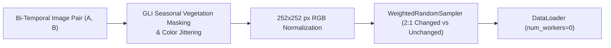

# System & Architectural Overview: Remote Sensing Change Captioning across Branches
**Current Branch:** `x` (Derived from `aug` / CodeAug architecture)  
**Target Hardware:** ADA Cluster (`gnode004` NVIDIA GTX 1080 Ti 11 GB VRAM & CPU Nodes)

---

## 1. Purpose of this Document
This reference note documents our complete architectural evolution across branches (`phase_6`, `phase_7`, `phase_8`, and `aug` / CodeAug), our data processing pipeline, allocated hardware constraints, and the mandatory **Ground Rules** for live layer-by-layer experimentation in Jupyter Notebooks on branch `x`.

---

## 2. Evolution of Architecture Across All Branches

```mermaid
graph TD
    subgraph "Legacy Tile-Based Architecture (phase_6, phase_7, phase_8)"
        L_A["Image A & B"] --> L_RC["RemoteCLIP ViT-B/32 (Frozen, ~87M)"]
        L_RC --> L_Tile["Spatial Tile Extraction"]
        L_Tile --> L_Diff["TileDifference Module<br/>(Phase 7: Attention + MLP)<br/>(Phase 8: [A,B,A-B,B-A] MLP ~2.6M)"]
        L_Diff --> L_Trans["Tile Fusion Transformer Encoder (2 Layers, ~6.6M)"]
        L_Trans --> L_Dec["SimpleDecoder + Contrastive Head (~2.8M)"]
        L_Dec --> L_Out["Total Trainable: ~12.56M / Total Model: ~99.8M"]
    end

    subgraph "CodeAug Architecture (aug -> Branch x Base)"
        C_A["Image A & B (Exact 252x252 px)"] --> C_GLI["Bi-Temporal Union GLI Masking<br/>(Seasonality Vegetation Invariance)"]
        C_GLI --> C_ViT["RemoteCLIP ViT-L-14 (Frozen Base + Rank-16 Visual LoRA on 48 layers)"]
        C_ViT -->|324 Tokens (18x18 Grid)| C_QF["QFormerTokenCompressor<br/>(64 Learnable Latent Queries)"]
        C_QF -->|64 Compressed Prefix Tokens| C_LLM["Qwen2-VL-2B Causal Text Decoder<br/>(~1.54B Pruned, 4-bit NF4 Quantization)"]
        C_LLM --> C_Out["Total Trainable: ~9.81M (0.53%) / Total Model: ~1.86B<br/>Peak VRAM: 3.48 GB"]
    end
```

### A. `phase_6` & `phase_7` (Baseline Tile-Based Model)
* **Backbone:** `RemoteCLIP ViT-B-32` (Frozen, ~87M parameters, 512-dim features).
* **Tile Mechanism:** Extracted spatial patches/tiles from bi-temporal images.
* **Difference Module:** Used per-tile forward cross-attention (`MultiheadAttention` + `LayerNorm`) between *Before* and *After* features, concatenated with absolute differences.
* **Fusion & Decoder:** A 2-layer Transformer Encoder (`d_model=512, FFN=2048`) fused tile representations, followed by a `SimpleDecoder` and contrastive alignment head.

### B. `phase_8` (Simplified Difference + Heavier Regularization)
* **Backbone:** Same `RemoteCLIP ViT-B-32` (~87M frozen).
* **Difference Module Simplification:** Replaced forward cross-attention with directional linear differences (`[A, B, A-B, B-A]` into an MLP, 2,626,048 parameters).
* **Trainable Footprint:** `12,561,128 parameters (~12.56M)` out of `~99.8M` total.
* **Why `phase_8` Degraded:**
  1. **Doubled Dropout Rates:** `fusion_dropout` increased from `0.10 -> 0.20`, `diff_mlp_dropout` `0.10 -> 0.15`, and `decoder_dropout` `0.10 -> 0.15`. Without extending the training schedule, this over-regularized the 12.56M trainable head and caused underfitting.
  2. **Removal of Cross-Attention:** Lost non-linear feature alignment between tile pairs before the fusion encoder.
  3. **Decoding Penalty:** Added an aggressive repetition penalty in greedy decoding that distorted n-gram evaluation metrics.

### C. `aug` / `x` (CodeAug — State-of-the-Art Base for New Venture)
* **Visual Backbone:** `RemoteCLIP ViT-L-14` with **Rank-16 Visual LoRA** targeting `c_fc` and `c_proj` across 48 linear layers (`9.81M trainable parameters`).
* **Patch Grid & Resolution:** Enforces exact **`252 x 252 px`** resolution ($252 \div 14 = 18 \times 18 = \mathbf{324\text{ visual patch tokens}}$ per image) with 2D bicubic interpolation on positional embeddings.
* **Seasonal Vegetation Invariance:** Computes RGB **Green Leaf Index (GLI)** $\frac{2G-R-B}{2G+R+B}$ and applies **Bi-Temporal Union Masking** ($M_{\text{veg}} = M_A \cup M_B$) with hue/saturation jitter (`mag=0.25`) to eliminate false-positive change detections caused by Indian monsoon seasonal foliage shifts.
* **Token Compression:** Leverages `QFormerTokenCompressor` with `64` learnable latent queries to compress `324` spatial tokens down to `64` prefix tokens (a **61.3% sequence length reduction**), avoiding KV-cache bloat.
* **Causal LLM Decoder:** Retains **`Qwen2-VL-2B`** (~1.54B parameters after pruning its native vision tower) loaded in **4-bit NF4 Quantization** (`bnb_4bit_compute_dtype=torch.float16`).
* **VRAM Profile:** Verified empirical **Peak Training VRAM of `3.48 GB`** on NVIDIA GTX 1080 Ti (`11 GB`), leaving `7.52 GB free headroom`.

---

## 3. Dataset & Data Processing Pipeline



1. **Datasets Used:**
   * **Stage 1 (Foundation Pre-Training):** Standard **LEVIR-CC** (~10,000 bi-temporal pairs) to learn robust change-captioning grammar and semantics.
   * **Stage 2 (Indian Domain Adaptation):** Curated **Indian Urban Google Earth Pairs** (~200–500 pairs) featuring dense settlements, corrugated tin roofs, terracotta tiles, and monsoonal vegetation changes.
2. **Class Imbalance Control:**
   * Uses a single-lever **`2:1 WeightedRandomSampler`** (2 changed samples for every 1 unchanged sample) with standard unweighted Cross-Entropy loss ($\gamma=1.0$) to prevent change-seeking bias while protecting our Seasonal False-Positive Rate (**SFPR $< 5\%$**).
3. **Tokenization:**
   * Uses Qwen's native HuggingFace BPE Tokenizer (`AutoTokenizer`) with special tokens `<|im_start|>` and `<|im_end|>`.

---

## 4. Hardware Architecture & Allocated Environment Constraints

| Component | Allocated Hardware / Environment | Strict Operational Rule |
| :--- | :--- | :--- |
| **GPU Nodes (`gnode004`)** | NVIDIA GTX 1080 Ti (`11 GB VRAM`), Pascal `sm_61`, 4 CPU Cores | **Must use 4-bit NF4 Quantization** with **`bnb_4bit_compute_dtype=torch.float16`** (Pascal GPUs lack native BF16 support). |
| **CPU Nodes** | 16–32 x86_64 CPU Cores, 36 GB+ RAM, No CUDA | Run in **FP32 Full Precision** with PyTorch multi-threading (`OMP_NUM_THREADS=$SLURM_CPUS_PER_TASK`). |
| **SLURM / Shared Limits** | ADA Cluster Multiprocessing Constraints | **ALL PyTorch DataLoaders MUST use `num_workers = 0`**. Multiprocessing workers (`num_workers > 0`) cause shared-memory deadlocks on the ADA cluster. |
| **Effective Batch Size** | `batch_size = 2`, `grad_accum_steps = 8` | Achieves effective batch size of **16** within ~3.48 GB VRAM footprint. |

---

## 5. Ground Rules for Live Jupyter Notebook (`x.ipynb`) Interactive Experimentation

To experience and test every lever layer-by-layer without waiting for long 24-hour training runs, **all live Jupyter Notebook experimentation on branch `x` MUST adhere to the following 4 Ground Rules**:

### Rule 1: The "Mini-Dataset" Fast-Validation Toggle
* **Never run full dataset loops when debugging or testing a layer.**
* Every notebook must define a clear `MAX_DEBUG_SAMPLES` parameter (e.g., `32` or `64` samples / `2–4` batches) at the top of the notebook.
* When `DEBUG_MODE = True`, the DataLoader must slice the dataset to run a full forward pass, loss calculation, backward pass, and evaluation metric check in **under 30 seconds**.

### Rule 2: Layer-by-Layer Verification Cells
The interactive notebook (`x.ipynb`) must be structured into independent, inspectable checkpoints so you can examine every lever yourself:
1. **Lever 1: Data Processing & GLI Vegetation Masking**
   * *Inspection:* Visualizing Image A, Image B, the computed GLI vegetation mask, and the resulting augmented tensors to verify seasonal invariance.
2. **Lever 2: Visual Backbone & Token Extraction (`ViT-L-14` + `LoRA`)**
   * *Inspection:* Checking tensor shapes of the `324` spatial patch tokens (`18x18` grid) and confirming that only LoRA parameters (`c_fc`, `c_proj`) have `requires_grad = True`.
3. **Lever 3: Q-Former Token Compression (`324 -> 64` tokens)**
   * *Inspection:* Checking the forward pass through `QFormerTokenCompressor`, verifying the 61.3% token reduction (`(B, 64, 1536)` shape), and inspecting cross-attention query weights.
4. **Lever 4: Causal LLM Text Decoder (`Qwen2-VL-2B` in 4-bit NF4)**
   * *Inspection:* Checking prompt formatting, tokenization IDs, 4-bit NF4 memory usage, and the output logits shape `(B, seq_len, vocab_size)`.
5. **Lever 5: Loss Computation & Backward Pass Optimization**
   * *Inspection:* Verifying unweighted Cross-Entropy loss ($\gamma=1.0$), executing a single backward pass, checking gradient norms on LoRA and Q-Former weights, and executing `optimizer.step()`.
6. **Lever 6: Generation & Metric Suite (BLEU, CIDEr, SFPR/SFNR)**
   * *Inspection:* Generating captions on test pairs (comparing Greedy vs. Beam Search) and computing CIDEr, semantic cosine similarity, SFPR (target $<5\%$), and SFNR (target $<8\%$).

### Rule 3: Strict Hardware & Cache Hygiene
* Every execution block must include an explicit memory cleanup helper (`torch.cuda.empty_cache()` / `gc.collect()`) to prevent VRAM accumulation across interactive notebook cells.
* Always assert `num_workers = 0` before initializing any DataLoader.

### Rule 4: Zero Black-Box Code
* All custom modules imported into the notebook must be clearly inspectable, with explicit shape documentation and print assertions so you can see exactly how data transforms at each step.
