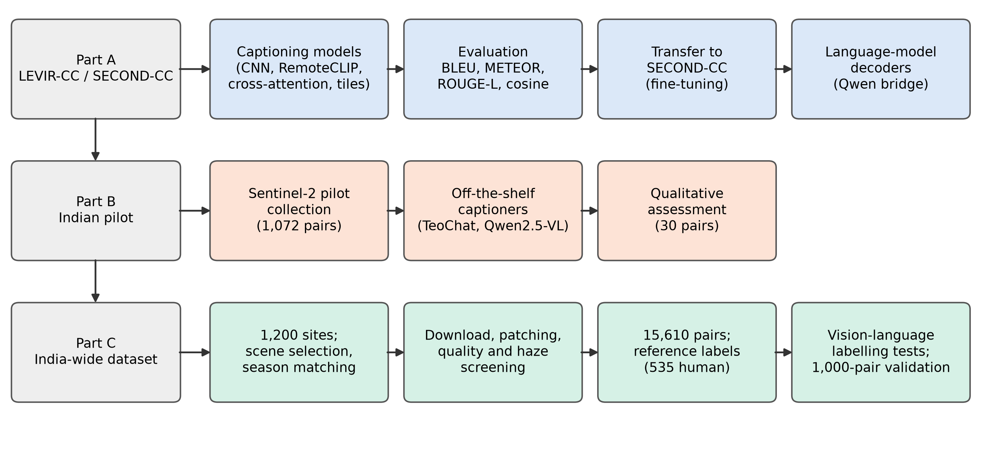
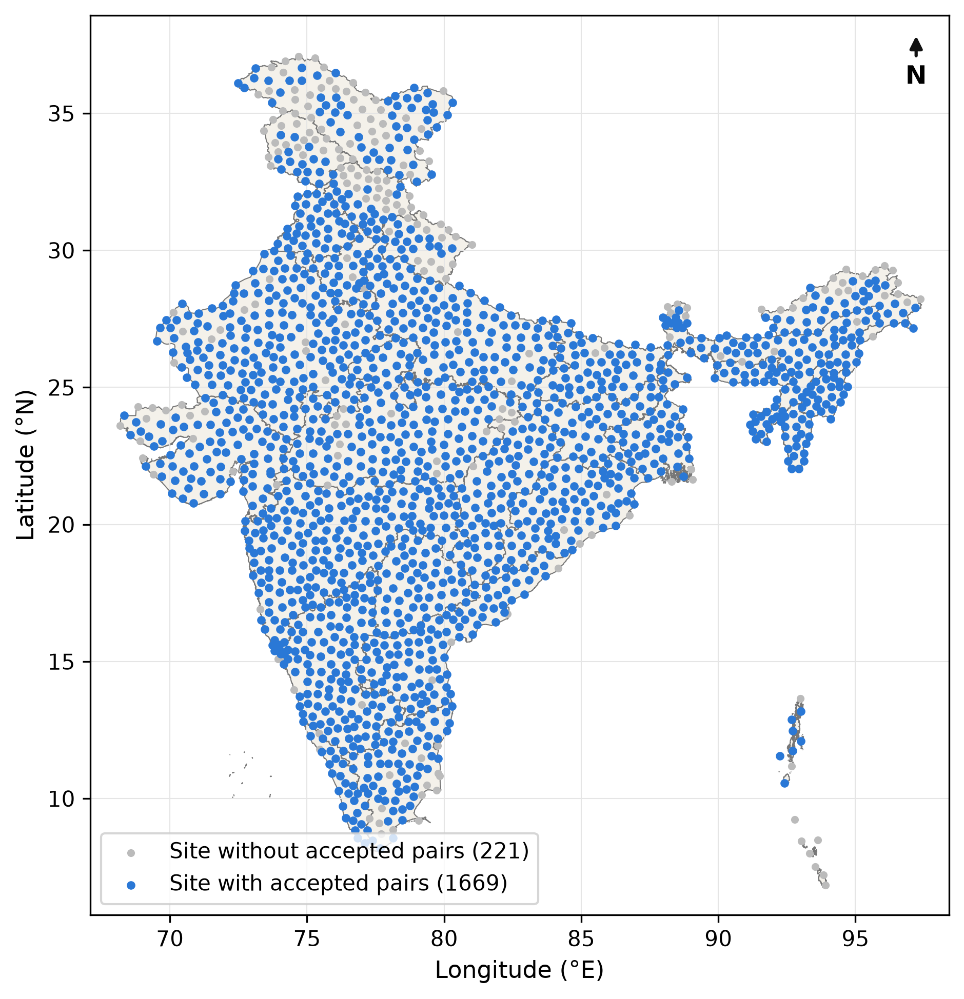
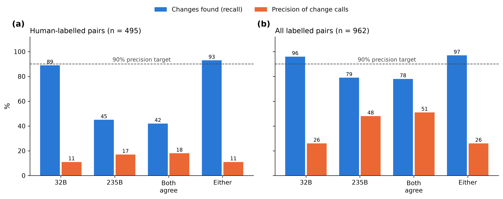
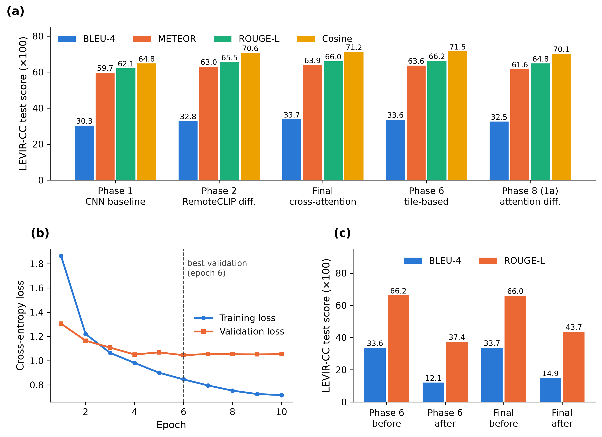

# Remote Sensing Image Change Caption Generation for Indian Sentinel-2 Imagery

**Independent Study, Monsoon 2026** · Sankalp Chaturvedi (2025201083), KSPSVLN Siddardha Kumar Kavuri (2025201061), Rinkesh Verma (2025201070) · Mentor: Rama Chandra Prasad

**Final report:** [RSICC_Report.pdf](report/RSICC_Report.pdf) · **Appendix:** [RSICC_Appendix.pdf](report/RSICC_Appendix.pdf) (Word versions in [`report/`](report/))

Change captioning means writing a sentence about what changed between two satellite images of the same place. Existing datasets use sub-metre imagery of a few foreign cities; nothing exists for India or for the free 10 m Sentinel-2 imagery that covers it. We tested whether this gap can be closed by transferring existing models, by using off-the-shelf captioners, or by building an Indian dataset and labelling it automatically with large vision-language models.

## Main results

| Part | What we did | Result |
|---|---|---|
| **A. Captioning models** | Seven designs trained and compared on LEVIR-CC in one pipeline | A frozen RemoteCLIP encoder gave the largest gain (BLEU-4 0.303 → 0.328); more complex fusion added at most 0.009 |
| | Fine-tuning on SECOND-CC | Catastrophic forgetting: LEVIR-CC BLEU-4 fell to 0.12–0.15 |
| | Language-model decoders (Qwen) | NaN losses, then degenerate output; not usable on the available GPUs |
| **B. Off-the-shelf captioners** | TEOChat and Qwen2.5-VL on Indian pilot pairs | TEOChat: "nothing changed" for 27/30 pairs; Qwen2.5-VL: empty or garbled output for 23/30 |
| **C. India-wide dataset** | 1,200 sites over all states and union territories, Sentinel-2 2019–20 vs 2025–26 | **15,610** quality-screened, season-matched pairs from 1,669 sites (of 27,888 examined) |
| | Reference labels | **1,002** labelled pairs, 535 labelled blind by a human |
| | Automatic labelling with vision-language models (prompts, region hints, change map, model size, 1,000-pair validation) | Best rule correct on at most about **half** of its change calls, against the 90% needed |

**Conclusion.** Neither transfer from existing datasets nor automatic labelling with current vision-language models gives reliable change captions for 10 m Indian imagery. The models confuse seasonal crop and water differences with lasting land-use change. The screened dataset, labelled pairs and review tools are released as a base for human-annotated work.

*Left: sampled sites across India (blue: sites with accepted pairs). Right: recall and precision of "change" calls in the 1,000-pair validation; the dashed line is the 90% precision target.*

*LEVIR-CC test scores per model (a), Phase 2 learning curves (b), and forgetting after SECOND-CC fine-tuning (c).*

## How the work was done

1. **Captioning models (Part A).** A modular pipeline on LEVIR-CC with shared data, vocabulary, loss and metrics (BLEU, METEOR, ROUGE-L, sentence-embedding similarity). Models: CNN baseline, RemoteCLIP difference encoder, cross-attention with contrastive alignment, tile-based model, and language-model decoders. Transfer was tested by fine-tuning on SECOND-CC.
2. **Indian pilot (Part B).** Sentinel-2 pairs over 60 hand-picked areas, captioned directly by two pretrained captioners.
3. **Dataset construction (Part C).** One 10.24 km Sentinel-2 block per site; scene selection on the reprocessed Collection-1 archive; block-level cloud, snow and water limits from the scene-classification layer; season-matched dates on the same pixel grid; haze and whiteout checks; 256×256 patches screened again, plus a model-based haze screen on the GPU cluster; splits by site.
4. **Labelling tests (Part C).** A web tool for blind human labelling; vision-language models (Qwen3-VL 8B/32B/235B, Gemma 3) tested with different prompts, region hints, a rule-based change map and a feature-based change gate; a final 1,000-pair validation scored against human labels with Wilson confidence intervals.

## Repository layout

| Folder | Contents |
|---|---|
| [`report/`](report/) | Final report and appendix (PDF and Word) |
| [`levir_cc_models/`](levir_cc_models/) | Part A: LEVIR-CC captioning pipeline (`src/`), models, notebooks with results, tests |
| [`india_pilot/`](india_pilot/) | Part B: pilot Sentinel-2 collection, cluster setup, off-the-shelf captioner outputs |
| [`india_s2_dataset/`](india_s2_dataset/) | Part C: site registry and downloader, screening pipeline (`pipeline/`), cluster haze screen (`cluster/`), labelling tools (`labeler/`, `validation_1k/`), experiment results (`data/RSICC/`, `validation_1k/`), change-map test, Kaggle packaging, report source and figures (`submissions/manuscript/`) |

Phase 7 (CodeAug) and Phase 8 code is on the `aug`, `modular` and `8.1` branches.

## Data and models

| Resource | Link |
|---|---|
| India Sentinel-2 Change Pairs (15,610 pairs) | [kaggle.com/datasets/kspsvlnsiddardha/india-sentinel2-change-pairs](https://www.kaggle.com/datasets/kspsvlnsiddardha/india-sentinel2-change-pairs) |
| Labelled subset (1,002 pairs) | [kaggle.com/datasets/kspsvlnsiddardha/india-sentinel2-change-labelled](https://www.kaggle.com/datasets/kspsvlnsiddardha/india-sentinel2-change-labelled) |
| Model run reports (prediction sheets) | [kaggle.com/datasets/kspsvlnsiddardha/rsicc-model-run-reports](https://www.kaggle.com/datasets/kspsvlnsiddardha/rsicc-model-run-reports) |
| Model checkpoints | [Kaggle](https://www.kaggle.com/models/kspsvlnsiddardha/rsicc-change-captioning) · [huggingface.co/Kspsvln/IS](https://huggingface.co/Kspsvln/IS) · [huggingface.co/Kspsvln/IS_phase2](https://huggingface.co/Kspsvln/IS_phase2) |

Image data is not stored in this repository. Contains modified Copernicus Sentinel data (2019–2026).
