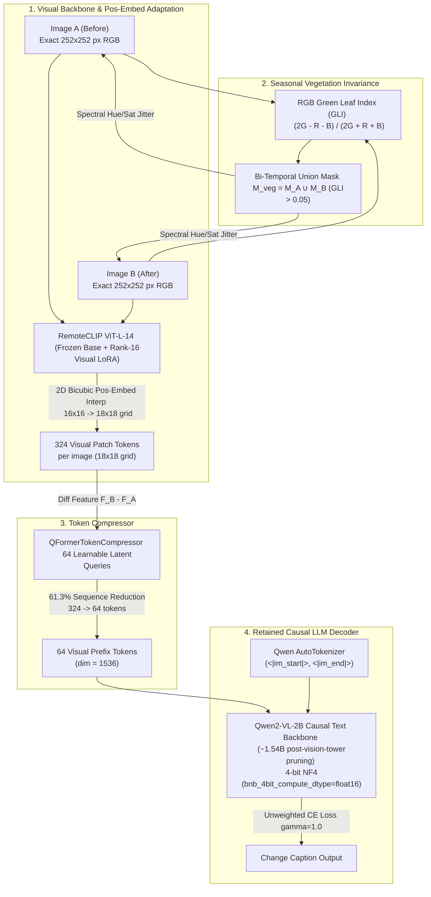

# CodeAug: Indian Urban & Seasonal RSICC — Implementation & Training Guide
**Branch:** `aug` | **Target Hardware:** ADA Cluster (`gnode004` NVIDIA GTX 1080 Ti 11 GB VRAM & CPU Compute Nodes)

---

## Branch `8.1`: Stage-1b NaN fix

The Aug 14, 2026 cluster run of Phase 8 Stage 1b (`phase8_finetune.ipynb`) diverged to NaN loss and separately crashed with a `NameError` before Approach A/B vs. C could be compared. Root cause and fix for each, applied on branch `8.1`:

- **NaN loss (Approach A/B):** `Phase8HybridModelAB`'s Adaptive Bridge (`self.diff_to_llm`) had no normalization after its final `Linear` layer, so it could hand the frozen Qwen2-0.5B decoder an unbounded-magnitude vector. Propagated through ~24 transformer layers running entirely in `float16` (max value ≈65,504), this overflowed to `inf`, which cascades to `NaN` in the loss. Fix: added `nn.LayerNorm(self.llm.config.hidden_size, dtype=torch.float16)` after the bridge's final `Linear`, bounding the vector before it enters the frozen LLM. (Verified separately that `transformers==4.39.3`'s `Qwen2ForCausalLM.forward` already upcasts logits to float32 before computing loss, so the overflow was happening earlier, inside the frozen forward pass — not in the loss math.)
- **`NameError: name 'metrics_c_levir' is not defined`:** in the "Evaluate Approach C on LEVIR-CC" cell, `metrics_c_levir` was only pre-set to `None` on the checkpoint-missing/Approach-C-skipped paths, not when a checkpoint was found — so the later `if metrics_c_levir is None:` check in the final comparison cell threw when a checkpoint existed. Fix: pre-initialize `metrics_c_levir, samples_c_levir = None, None` at the top of that cell, before the checkpoint-found/not-found branching.

No other cells, models, or configs were changed.

---

## 1. Why We Created the `aug` Branch
Standard Remote Sensing Image Change Captioning (RSICC) models trained on Western/Chinese suburban datasets (e.g., **LEVIR-CC**) experience severe performance degradation when deployed on **Indian urban Google Earth imagery** due to two primary domain-shift bottlenecks:

1. **Unique Urban Morphology:** Indian cities exhibit dense, organic settlements and diverse rooftop materials (corrugated tin sheets, terracotta tiles, RCC slabs, asbestos) that differ dramatically from planned suburban buildings. A frozen vision backbone frequently misinterprets reflective tin roofs as structural noise.
2. **Monsoonal Seasonal Shifts:** Indian satellite images undergo severe spectral color shifts between dry summer (brown soil) and lush monsoon (green foliage). Without targeted seasonal invariance, models hallucinate false structural construction/demolition whenever foliage changes color.

The `aug` branch implements the **CodeAug Protocol**: a unified, hardware-verified architecture that resolves patch arithmetic, eliminates seasonal false positives, corrects class imbalance bias, and retains the full **Qwen2-VL-2B causal LLM decoder** via 4-bit NF4 quantization on 11 GB Pascal GPUs.

---

## 2. Architecture & The 6 CodeAug Engineering Resolutions



### The 6 Architectural Specifications
1. **Patch Grid Math & Pos-Embeds:** Enforce exact **`252 x 252 px`** input resolution ($252 \div 14 = 18 \times 18 = \mathbf{324\text{ clean tokens}}$). Apply 2D bicubic interpolation to ViT pos-embeds ($16 \times 16 \to 18 \times 18$), excluding the CLS token at index 0.
2. **Decoder Backbone Routing:** Retain **`Qwen2-VL-2B` as the causal LLM text decoder** (`~1.54B` parameters). Explicitly prune its native vision tower (`model.visual = None`) to conserve VRAM.
3. **Token Compression (Q-Former):** Use `QFormerTokenCompressor` with `64` learnable latent query tokens. Compresses `324` spatial tokens $\to$ `64` tokens (a **61.3% sequence reduction**, total sequence `424 -> 164 tokens`), preventing KV-cache bloat.
4. **Bi-Temporal Union GLI Masking:** Use RGB **Green Leaf Index (GLI)**: $\frac{2G-R-B}{2G+R+B}$. Enforce **Bi-Temporal Union Masking** ($M_{\text{veg}} = M_A \cup M_B$), applying hue/saturation jitter (`mag=0.25`) to transition pixels in **both** images to eliminate directional brown $\leftrightarrow$ green bias.
5. **Class Imbalance Control:** Enforce a **single-lever $2 : 1$ `WeightedRandomSampler`** with standard unweighted Cross-Entropy loss ($\gamma=1.0$). Prevents compounding change-seeking bias and protects our Seasonal False-Positive Rate (**SFPR $< 5\%$**).
6. **Tokenizer & Special Tokens:** Replace custom hand-rolled vocabularies with Qwen's native HuggingFace BPE Tokenizer (`AutoTokenizer`) and special tokens (`<|im_start|>`, `<|im_end|>`).

---

## 3. Mandatory Empirical Pre-Flight Calibration (`check_vram_calibration.py`)

No VRAM or timing assertion is trusted without empirical measurement. Before launching training on ADA Cluster node `gnode004`, execute the pre-flight check:

```bash
python check_vram_calibration.py
```

### Verified Empirical Numbers on `gnode004` (GTX 1080 Ti 11 GB VRAM):
* **True Post-Pruning Causal LLM Parameters:** `1.543 Billion`
* **Total Model Parameters:** `1,856.38 Million` (`~1.86B`)
* **Trainable Parameters:** `9.81 Million (0.53%)` (Visual LoRA `r=16` across 48 layers + Q-Former queries)
* **Static Loaded Weights VRAM:** `2.94 GB` (with FP16 ViT-L-14 + 4-bit NF4 Qwen causal text decoder)
* **True Peak Training VRAM (Forward + Backward + `optimizer.step()`):** **`3.48 GB`**
* **GTX 1080 Ti Headroom:** **`7.52 GB free`** (safe from out-of-memory crashes even at larger batch sizes).

---

## 4. Hardware Profiles & Execution Rules

| Hardware Target | Compute Specification | Required Execution Configuration |
| :--- | :--- | :--- |
| **ADA GPU Node (`gnode004`)** | NVIDIA GTX 1080 Ti (`11 GB VRAM`), Pascal `sm_61`, 4 CPU Cores | Use **4-bit NF4 Quantization** with **`bnb_4bit_compute_dtype=torch.float16`** (resolves Pascal's lack of native BF16). `batch_size=2, grad_accum=8` (Effective Batch 16). |
| **ADA CPU Compute Node** | 16–32 x86_64 CPU Cores, 36 GB+ RAM, No CUDA | Run in **FP32 Full Precision** with PyTorch multi-threading (`OMP_NUM_THREADS=$SLURM_CPUS_PER_TASK`). **Note:** SLURM script must explicitly request `--cpus-per-task=16` (or `32`) to override the 4-core default. |
| **Shared SLURM Limits** | ADA Cluster Multiprocessing Limits | All DataLoaders must enforce **`num_workers = 0`** to prevent shared-memory deadlock. |

---

## 5. End-to-End Two-Stage Training Instructions

### Step 1: Environment & Dependency Setup
```bash
# Activate your conda/virtual environment on ADA cluster
source venv/bin/activate
# OR: source ~/miniforge3/envs/mlenv/bin/activate

# Install required dependencies
pip install -r requirements.txt
```

### Step 2: Stage 1 Foundation Pre-Training (LEVIR-CC)
Train the Q-Former + Visual LoRA (`r=16`) + Qwen causal decoder on LEVIR-CC (~10,000 pairs) to master change-captioning syntax:
* **Epochs:** `10`
* **Effective Batch Size:** `16` (`batch_size=2`, `grad_accum_steps=8` on `gnode004`)
* **Learning Rates:** `1e-4` (Q-Former), `5e-5` (Visual LoRA)
* **Estimated Runtime:** `~2.5 Hours` on GTX 1080 Ti (`~14 Hours` on 32-Core CPU Node)

### Step 3: Stage 2 Indian Domain Adaptation
Fine-tune on Indian urban Google Earth pairs (~200–500 pairs) with Bi-Temporal Union GLI Jitter and 2:1 WeightedRandomSampler:
* **Epochs:** `15`
* **Learning Rate:** `2e-5`
* **Estimated Runtime:** `~10 Minutes` on GTX 1080 Ti (`~25 Minutes` on 32-Core CPU Node)

### Running on ADA Cluster via SLURM
Submit the automated execution script:
```bash
sbatch execute_phase7.sh
```

---

## 6. Balanced Evaluation & Diagnostic Suite

Evaluate held-out Indian test set (~50–100 pairs) across seven metrics:
1. **Standard Literature Benchmarks:** BLEU-1, BLEU-2, BLEU-3, BLEU-4, METEOR, ROUGE-L, and **LEVIR-CC Anchored CIDEr** (using static IDF weights from `checkpoints/levircc_cider_idf.pkl`).
   * *Tradeoff Note:* Anchored CIDEr provides high statistical stability on small test sets, but may inflate scores for Indian domain words (*tin, terracotta, RCC*) that are rare in LEVIR-CC.
2. **Domain & Seasonal Diagnostics:**
   * **Semantic Cosine Similarity:** Evaluated via `SentenceTransformer ('all-MiniLM-L6-v2')` to verify structural meaning even when phrasing varies.
   * **SFPR (Seasonal False-Positive Rate):** Evaluated on unchanged Indian pairs with heavy seasonal vegetation shifts (`changeflag == 0`). **Target: $< 5\%$.**
   * **SFNR (Structural False-Negative Rate):** Evaluated on changed Indian pairs with color/albedo shifts (`changeflag == 1`). **Target: $< 8\%$.**
