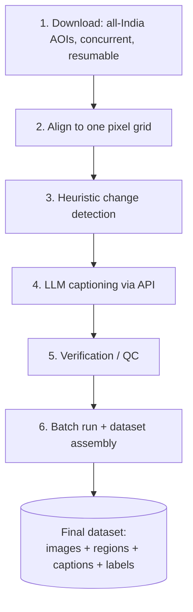

# Indian Bi-Temporal Change Dataset — Master Plan

*History of how this design was reached — what broke, what was learned, what got
fixed — is kept separately in [`JOURNEY.md`](JOURNEY.md), so this file stays a
description of the current design, not a log.*

## Problem

There is no ready-made bi-temporal (before/after) change-captioning dataset for
Indian satellite/aerial imagery. Building one requires, for every pair: (1) confirming
whether real land-cover/land-use change occurred at all, (2) localizing where in the
frame it occurred, and (3) describing it in natural language — while explicitly not
mislabeling clouds, shadow, sun angle, and seasonal vegetation color as "change." Doing
this by hand does not scale to the pair counts a dataset needs (thousands+); doing it
with a single unguided model call is unreliable on subtle, localized change sitting
inside an otherwise-quiet scene. The plan below is the pipeline that resolves both:
cheap deterministic preprocessing to propose *where* to look, and an open-weight
vision-language model, called via a hosted API in a way that has been validated to
actually get the *what* right, to generate the label.

## Architecture overview



| Stage | Module(s) | Status | Output |
|---|---|---|---|
| 1. Download | `build_aoi_registry.py`, `locations.py` + `locations/india_aois.csv`, `stac_select.py`, `state_db.py`, `aoi_download.py`, `download_batch.py` | **Built; 200-pair pilot running.** | 1024×1024 uint8 before/after + SCL masks per site, tracked in SQLite |
| 2. Align | `pair_alignment.py` | Built | Identical-grid before/after arrays |
| 3. Detect | `change_visualization.py` | Built (unchanged since the prototype) | Heatmap, attention map, candidate regions |
| 4. Caption | `vlm_captioning.py` | Built; two-stage path validated against a manual review set | Structured caption + per-region labels |
| 5. Verify | `review_gallery.py` + manual review | Built | Confirmed/flagged sample |
| 6. Assemble | — | **Not built.** | Final dataset records on disk |

---

## Stage 1 — Download (all-India, concurrent, resumable)

**Goal: ~15,000 before/after 256×256 patch pairs, spread evenly over every state and UT.**

**Unit of download: one Sentinel-2 block.** True-colour images are stored as 1024×1024 px
blocks (~1.8 MB), and a read always fetches whole blocks. So a site is exactly one block:
10.24 km square, 1 pair, 16 patches. A free-floating site of the same size can straddle up
to 4 blocks; measured on a real pair, that fetched ~14 MB to keep 1 MB. Block-aligned, the
whole 15k-patch target is ~3.4 GB to fetch.

**Where the sites are** (`build_aoi_registry.py` → `locations/india_aois.csv`, map in
`locations/coverage_map.png`):
- 1,200 sites across all 36 states/UTs (geoBoundaries ADM1, CC BY 2.5 IN). Each state or UT
  gets at least 12, or fewer where it's too small for 12 separate blocks (Delhi 6,
  Puducherry 2, DNH&DD 2, Chandigarh 1, Lakshadweep 1). The rest are shared by area.
- Inside each state, farthest-point sampling spreads sites evenly, also keeping them away
  from sites already placed in neighbouring states.
- Rows are interleaved by state, so any first N rows (e.g. the pilot) cover all of India.
- 1,200 sites is headroom: ~940 successful sites × 16 patches = 15k at ~80% success.
- The 3 original curated sites are appended at the end.
- Sampling is spatially even, **not** biased toward change. The pilot measures how much
  real change even sampling gives before the full run.

**Season per region** (July–June cycles: 2019 means Jul 2019–Jun 2020, 2025 means Jul
2025–Jun 2026, since the reprocessed archive is sparse before May 2019):

| Region | Months | Block-cloud limit | Why |
|---|---|---|---|
| Most of India | Nov–Mar | 1% | post-monsoon dry season |
| Tamil Nadu, Puducherry | Jan–Apr | 1% | NE monsoon Oct–Dec |
| Kerala | Dec–Mar | 3% | persistent cloud |
| Northeast (Assam, Meghalaya, Nagaland, Manipur, Mizoram, Tripura) | Nov–Mar | 3% | persistent cloud |
| J&K, Himachal, Uttarakhand | Oct–Dec | 1% | clear, before heavy snow |
| Sikkim, Arunachal | Oct–Dec | 3% | clear, before snow; cloudy |
| Ladakh | Jul–Oct | 1% | cold desert, snow-free late summer |
| Andaman & Nicobar, Lakshadweep | Jan–Apr | 3% | island dry season |

**Selection, per site** (`stac_select.py`, `aoi_download.select_pairs`), against Earth
Search's **Collection-1** (`sentinel-2-c1-l2a`, one processing baseline across years):
1. Search both seasons for scenes containing the site's centre (≤ 40% tile cloud prefilter),
   following every result page.
2. For each tile found in both years (up to 4 where tiles overlap; the tile holding the point
   most centrally first), take the full 1024 px block containing the point.
3. Keep scenes whose data footprint covers the block. The test is inset 250 m because
   footprint polygons sag up to 178 m inside the true tile edge.
4. Measure cloud/shadow/no-data over the block from the SCL mask (one ~20 KB read) for the 8
   lowest tile-cloud scenes per side; keep those within the block-cloud limit.
   A scene more than 20% snow or 70% water is not used: no ground detail under snow, and
   open sea or reservoir leaves little land to describe.
5. Pair before/after within 30 days of the same point in their seasons, with snow cover
   differing by ≤ 5%, so snowfall isn't counted as change. Best (clearest) pair wins.
6. After download, check the real pixels for what the SCL cloud mask misses. **Haze/fog:**
   the dates' darkest-blue levels differ by more than 25. **Whiteout:** more than 30% of a
   date is saturated white. A failing pair is swapped for the next candidate that doesn't
   reuse the bad date (up to 4 downloads per site); if both dates are white, the site is given up.

**Download & save** (`aoi_download.py`): both scenes are on the same tile grid, so the block
is read directly from each: the saved pixels are the source pixels, with no reprojection or
resampling. A pair is rejected if either image has > 0.1% no-data. Output per site:
`pair_1/before.tif`, `after.tif` (uint8 RGB 1024²), `scl_before.tif`, `scl_after.tif`,
`pair.json` (site, block, scene ids, dates, sun angle, baseline, block cloud). Written to
`.tmp` and renamed atomically. Each block is claimed in the DB, so two nearby sites never
save the same ground twice.

**State, concurrency, recovery** (`state_db.py`, `download_batch.py`): SQLite (WAL) tracks
every site (`pending → running → done / no_pairs / failed`), every pair, block claims, and
an event log. A killed run resumes where it stopped. 48 workers by default (measured best on this
network), changeable while running with `download_batch.py workers N`.
Transient network errors (DNS failures, resets, timeouts) retry the site 3 times with
backoff before it counts as failed.

```bash
conda activate rscc
python build_aoi_registry.py                         # regenerate the site list + map
python download_batch.py run --stop-after-pairs 200  # pilot (resumable)
python download_batch.py status --watch 30           # live progress
python download_batch.py run                         # full run: continues from the pilot
python download_batch.py run --retry failed          # re-attempt network failures
python review_gallery.py                             # browser review page: data/review/index.html
python review_gallery.py --import-labels review_labels.csv   # store review labels in the DB
```

## Stage 2 — Alignment

For Sentinel-2 this is done inside Stage 1: before and after come from the same tile, so the
block is read directly from both on one shared grid, with nothing resampled.
`pair_alignment.load_aligned_pair` remains for pairs that don't share a grid. It reprojects
both onto one grid over a WGS84 bbox, snapped to the source pixel grid, at the finer
resolution, and rejects partial coverage. It isn't used by the Sentinel-2 downloader.
`display_stretch()` (percentile stretch, 2/98) makes the viewable version for previews and
the model; raw arrays feed all calculations.

## Stage 3 — Heuristic change detection (grounding, not labeling)

`change_visualization.prepare_visual_evidence(before, after, ...)`:

1. Percentile-stretches both images, takes the per-pixel `|after - before|` difference
   → **heatmap**.
2. Box-blurs and normalizes it (`attention_radius`, default 6px) → **attention map**.
3. Thresholds the attention map at `attention_percentile` (default 75th percentile) →
   binary mask.
4. Flood-fills into connected components, drops anything under `min_region_pixels`
   (adaptive default: `max(40, pixel_count // 1000)`), keeps the top `max_regions`
   (default 8) ranked by `pixels × mean_score` → **candidate regions**.

Cheap, deterministic, no semantic understanding — it only answers "did the pixels
change here," never "what changed." Stage 4 is where semantic judgment happens.

## Stage 4 — LLM-based labeling via API

`vlm_captioning.py`, default model **`qwen/qwen3-vl-8b-instruct`** — an **open-weight**
vision-language model, called via **OpenRouter's** OpenAI-compatible endpoint (plain
`requests`, no extra SDK), rather than a closed proprietary API. `OPENROUTER_API_KEY`
is read from the environment or a local gitignored `.env` file — never hardcoded.

- **`caption_pair(...)`** — one call: images + region hints in, one structured JSON
  caption out (`overall_caption`, `change_type`, `likely_artifact`, per-region
  `description`/`confirmed`). Fast and cheap, but a real, localized change inside an
  otherwise-quiet scene can get swept into a dominant "probably seasonal" narrative and
  dismissed — this actually happened in review (`JOURNEY.md`, "Img27").
- **`caption_pair_two_stage(...)`** — the validated fix. Each region hint's before/after
  crop is described in a neutral pass first (no mention of shadow, season, or
  "artifact" permitted), then those neutral observations are carried into the normal
  full-scene call, instructed to trust a clearly-described local observation as real
  change rather than defaulting to the scene's dominant story. Costs ~2× a single
  hinted call. Requires at least one region hint.

Region hints improve **localization detail**, not detection accuracy — both call
shapes correctly detect a scene's dominant real change; hints add the per-region
breakdown, which two-stage now delivers reliably.

## Stage 5 — Verification / QC

`review_gallery.py` builds `data/review/index.html`: every pair as before/after thumbnails,
filterable by state, label and auto-flag. The large viewer has side-by-side, swipe, **blink**
(flips the dates in place, the fastest way to see change) and a difference map with
SCL cloud tinted blue. Keys 1–4 label a pair (real change / no change / cloud-haze / bad);
labels export to CSV and `--import-labels` stores them in the DB's `review` table. It's
incremental, so rerun it during a long download.

**Auto-flags** (the same `aoi_download.quality_flags` the downloader now enforces):
- **haze:** the two dates' darkest-blue values differ by more than 25. Same place and
  season should give the same dark floor; haze or fog lifts it in one date.
- **white:** more than 30% of a date is ≥ 245 in all bands (snow, or bright ground clipped
  by the 8-bit true-colour product), so there's no detail to caption.

Pay particular attention to: (a) auto-flagged pairs, (b) any caption with
`likely_artifact: true`, (c) small, low-score regions, which are easily folded into the
wrong story.

## Stage 6 — Batch execution & dataset assembly

**Not built.** Per pair, once Stage 1 has produced saved GeoTIFF pairs at scale:

1. Cut each aligned pair into 256×256 patches, dropping patches where the SCL mask
   shows cloud/shadow/nodata over the patch.
2. Score each patch with `change_visualization.prepare_visual_evidence` (mean
   attention, changed-area fraction); sample to roughly a 65/35 changed/no-change mix
   so the model also learns to say "no change."
3. Call `caption_pair_two_stage` per patch pair.
4. Persist a dataset record (schema below) plus the preview image used in
   verification.
5. Log token usage/cost per call so a run's total spend is auditable afterward.
6. Split train/val/test **at the AOI level**, not the patch level, so neighbouring
   patches can't leak across splits.

Suggested per-pair dataset record:

```json
{
  "pair_id": "sentinel2/<aoi_key>/pair_1/patch_003",
  "before_path": "...", "after_path": "...",
  "bbox_wgs84": [...], "crs": "...", "tile": "MGRS-43QBB",
  "heuristic": {"attention_percentile": 75, "attention_radius": 6, "regions": [...]},
  "caption": {
    "overall_caption": "...", "change_type": "...", "likely_artifact": false,
    "regions": [{"hint_index": 0, "description": "...", "confirmed": true}]
  },
  "model": "qwen/qwen3-vl-8b-instruct",
  "cost_usd": 0.00067,
  "verified": null
}
```

---

## Config reference (current defaults)

| Parameter | Default | Where |
|---|---|---|
| Site size | one Sentinel-2 block: 1024×1024 px = 10.24 km = 4×4 patches | `stac_select.py` |
| Sites | 1,200 even over 36 states/UTs (+3 curated) | `build_aoi_registry.py` |
| Before / after | July–June cycles 2019 / 2025, per-region months (table above) | `aoi_download.Config`, registry |
| Sentinel-2 collection | `sentinel-2-c1-l2a` (Collection-1, reprocessed) | `stac_select.py` |
| `max_aoi_cloud` | 1% of block pixels (3% in cloudy regions) | selection (SCL-based) |
| `max_nodata` | 0.1% (post-alignment all-zero pixels) | `aoi_download.py` |
| `n_pairs` per site | 1 | `aoi_download.Config` |
| `top_k` / `max_tiles` | 8 scenes per side / 4 tiles | selection |
| `max_snow_diff` / `max_snow` / `max_water` | 5% / 20% / 70% | selection (SCL) |
| Haze / whiteout check | dark-floor gap > 25 / > 30% white → next candidate (max 4 downloads) | `aoi_download.quality_flags` |
| Workers / network retries | 48 (measured best; live-changeable) / 3 with backoff + GDAL cache clear | `download_batch.py`, `aoi_download.Config` |
| `max_gap_days` | 30 (before/after position within season) | selection |
| `min_separation_days` | 15 (only matters with >1 pair per site) | selection |
| `stretch_low_percentile` / `high_percentile` | 2 / 98 | display + evidence |
| `attention_percentile` | 75 | region cutoff |
| `attention_radius` | 6px | heatmap smoothing |
| `min_region_pixels` | adaptive (`max(40, px//1000)`) | region floor |
| `max_regions` | 8 | region cap |
| `crop_padding` | 20px | two-stage region crops |
| Captioning model | `qwen/qwen3-vl-8b-instruct` (open-weight, via OpenRouter) | captioning |

## Current status & open items

- **Stages 1–3 and 5 are complete; the Stage 6 dataset (minus captions) is built:**
  `data/FINAL/` holds 15,610 accepted and 12,278 rejected patches, each labelled; a 65/35
  selected set of 8,808 split by site; `manifest.jsonl`/`.csv`; `REPORT.md`; `review.html`.
  Pipeline: `pipeline/` (orchestrator, patches, assemble, topup); Ada job: `cluster/`.
- **Haze screen:** Qwen3-VL-8B 4-bit on Ada. It misses about 19% of hazy patches and rejects
  about 28% of clean ones (trial figures), so some thin haze remains among accepted patches.
- **Next:** captioning (Stage 4) of the selected set, a human-checked gold set, and a live
  check of `caption_pair_two_stage`.
