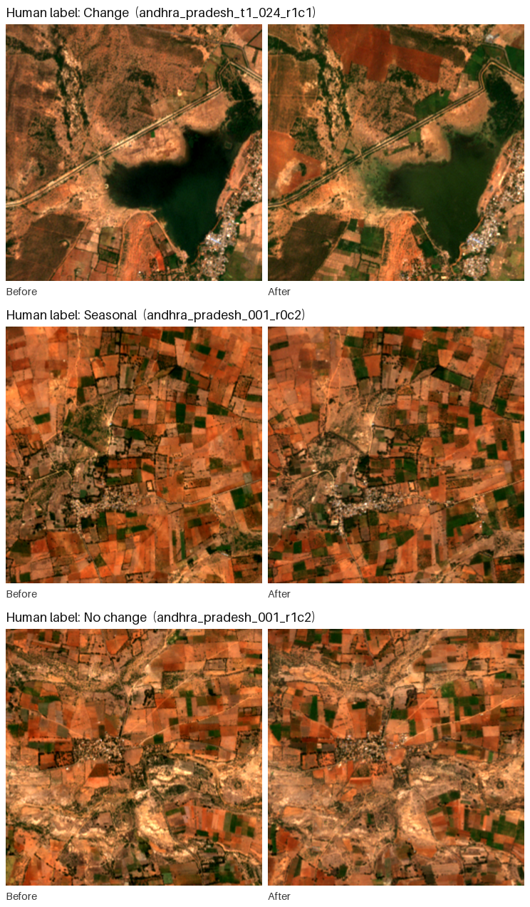

# Remote Sensing Image Change Caption Generation

*Building an India-wide bi-temporal Sentinel-2 dataset and evaluating vision-language models for automatic change labelling*

**[Author names]** · **[Affiliation]** · October 2026

---

## Preface

This report is part of a wider effort on remote sensing image change captioning (RSICC). Our first approach used the LEVIR-CC dataset with our own captioning pipeline, adapted to Indian Sentinel-2 imagery. That attempt was unsuccessful, so we built a dedicated dataset instead. This report covers that development: how the image pairs were acquired and filtered, how they were labelled, and how well vision-language models can label change automatically. A companion report covers the earlier work.

## Abstract

We built a bi-temporal dataset of 15,610 Sentinel-2 patch pairs (256×256 px, 10 m resolution) covering all 36 Indian states and union territories, with before and after images taken about six years apart in the same season. To label land-use change automatically, we evaluated open-weight vision-language models (Qwen3-VL 8B, 32B and 235B) under several prompting strategies, both with and without visual assistance (region hints, zoomed crops and a rule-based change map). We then validated the most promising setup on 1,002 labelled pairs, 535 of them reviewed by a human annotator. The best configuration found 78% of real changes, but only about half of its change calls were correct. Visual assistance didn't help: region hints suppressed detection, and maps presented as fact led the models to report change where there was none. At 10 m resolution, with real change in only about 15% of evenly sampled pairs and seasonal effects that look like change, these models can't reliably tell lasting land-use change from seasonal variation. **Scaling this pipeline to build a large dataset would therefore produce labels of unacceptably poor quality.**

---

## 1. Introduction

Remote sensing image change captioning means describing, in natural language, what has changed between two satellite images of the same place taken at different times. Most public RSICC datasets use very high-resolution imagery (≤1 m) from a few urban regions, mainly outside India. Models trained on them don't transfer well to the medium-resolution imagery (10 m) that is freely available across India. India-specific landscapes, such as smallholder farmland, monsoon-driven seasonal cycles, haze and arid terrain, are largely missing from these datasets.

Our goal was a large RSICC dataset for India built from freely available Sentinel-2 imagery. Labelling thousands of image pairs by hand isn't feasible, so we studied whether open-weight vision-language models (VLMs) could do it. That depends on three things:

1. **Detection:** deciding whether lasting land-use change has occurred, for example new buildings, roads, construction, mining, water bodies or cleared land.
2. **Discrimination:** not counting seasonal crop cycles, vegetation greenness, water level, haze or lighting as change.
3. **Description:** writing an accurate caption of what changed and where.

Section 2 describes how the dataset was built and Section 3 how the reference labels were made. Section 4 covers the experiments on prompting strategies, visual assistance and model size, and the 1,000-pair validation. Results follow in Section 5, limitations in Section 6 and conclusions in Section 7. The experiments show that detection and, above all, discrimination are where current VLMs fail at this resolution.

## 2. Dataset construction

**2.1 Imagery.** We used Sentinel-2 Level-2A surface-reflectance imagery from the reprocessed Collection-1 archive (Earth Search STAC), which applies one processing baseline across all years, so a change in processing can't look like a change on the ground. We used the true-colour (RGB) product at 10 m resolution. Before images come from the 2019–20 season and after images from 2025–26.

**2.2 Site sampling.** We placed 1,200 sites evenly across all 36 states and union territories (Figure 1), with at least 12 sites per state where its area allowed and the rest distributed by area. Sites were spread out by farthest-point sampling. Each site is one 10.24 km × 10.24 km Sentinel-2 storage block, which makes downloads efficient. Sampling was deliberately even and not biased toward known change.

*Figure 1. Sites across all Indian states and union territories.*

**2.3 Season matching.** To keep seasonal differences small, both dates of a site come from the same region-specific dry-season window, for example November–March for most of India, January–April for Tamil Nadu, and October–December for the western Himalaya. The two dates are no more than 30 days apart in their position within the season.

**2.4 Scene selection and quality control.** For each site:

- Scenes had to cover the whole block.
- Cloud, shadow and no-data were measured over the block itself from the scene-classification mask: at most 1% (3% in persistently cloudy regions).
- Scenes with more than 20% snow or 70% water were excluded, and the two dates had to differ in snow cover by at most 5%.
- After download, pairs were checked for haze and for saturated white areas, and swapped for the next candidate if they failed.

**2.5 Patches and screening.** Each block was cut into sixteen 256×256 px patches (2.56 km × 2.56 km). Each patch was screened again for no-data, cloud and shadow, snow, water and saturation. Remaining haze was screened with Qwen3-VL-8B (4-bit) on a local GPU cluster.

**2.6 Result.** Of 27,888 patch pairs, **15,610 were accepted** and 12,278 rejected:

| Rejection reason | Pairs |
|---|---|
| Haze or cloud (model screen) | 10,994 |
| Misaligned | 592 |
| Water | 408 |
| Snow | 133 |
| No-data | 77 |
| Cloud or shadow | 55 |
| Whiteout | 19 |

Train/validation/test splits were made by site, so no site appears in more than one split. The haze screen is imperfect: in a 100-pair trial it caught about 81% of hazy pairs and rejected about 27% of clean ones.

## 3. Reference labels

**3.1 Labelling scheme.** Each pair gets one of four classes:

- **Change:** lasting land-use change, such as new or expanded buildings, roads, construction, quarries or mines, new water bodies, cleared vegetation, or solar farms.
- **Seasonal:** only crop stage, vegetation greenness or water level differ.
- **No change.**
- **Can't tell:** haze or cloud prevents comparison.

Change and seasonal pairs also get a one-sentence description of what differs and where (Figure 2).

*Figure 2. Human-labelled examples of the three decidable classes.*

**3.2 Human-supervised, AI-assisted labelling protocol.** We built a web-based review tool that works in two steps:

1. **Category.** The annotator sees the before and after images side by side, with a blink view that flips between the two dates. They choose one of the four classes before seeing any AI output.
2. **Verification.** The AI suggestion is then shown. For change and seasonal pairs, the annotator accepts the AI-drafted description or rewrites it.

The annotator's answer is always final. Their first choice, made before seeing the AI suggestion, is also recorded so that any influence from the AI can be measured.

**3.3 Labels used in this study.** For this evaluation, the human review used **step 1 only**: a blind choice of category, with no AI output visible. The pairs reviewed were those where a test model and the AI suggestion disagreed, plus a random sample where they agreed. All results in Section 5 are computed on these human labels. Step 2 (caption verification) is part of the toolkit for building the final dataset.

## 4. Experiments

All experiments used open-weight Qwen3-VL models (8B, 32B, 235B-A22B; Gemma-3-27B in one test) via an API, at temperature 0. Inputs were the before and after images, contrast-stretched together and upscaled to 512×512. In the tables below, a pair is scored with the human label where one exists, and with the development label otherwise (about half of each test set is human-labelled).

### 4.1 Prompting without assistance

The model saw only the two images. Three prompt styles were tested:

**(a) Constrained 4-class prompt with a tie-break rule** ("if unsure between land-use and seasonal, choose seasonal"). 57 decidable pairs, 12 with change:

| Model | Changes found | False changes |
|---|---|---|
| Qwen3-VL-8B | 10/12 | 8/45 |
| Gemma-3-27B | 8/12 | 16/45 |
| Qwen3-VL-32B | 11/12 | 16/45 |
| Qwen3-VL-235B | 4/12 | 1/45 |

A stricter two-model rule (32B confident at ≥0.9, the 8B agrees, and the named location contains changed pixels) found only 7 of 15 changes on a fresh 100-pair sample. The models' self-reported confidence was also unusable: the 8B gave 0.95 on every pair.

**(b) Neutral 4-class prompt** (8B): **24/33** changes found, **12/82** false changes, and **0/15** false changes on control pairs where the after image was identical to the before image.

**(c) Free-form question**, with no categories and no output format: *"Before and after images of the same place, 6 years apart. Has anything lasting changed (like buildings, roads, ponds, cleared land), or are the differences only seasonal?"* A separate text-only call classified each answer. 37 decidable pairs:

| Model | Changes found | False changes |
|---|---|---|
| 32B | 10/10 | 13/27 |
| 235B | 8/10 | 4/27 |

The models explained their reasoning in their own words, which made errors easy to trace. The 235B consistently described real construction as "seasonal or agricultural variation".

**Finding:** prompt wording shifts the balance between missed changes and false changes, but no prompt removes the confusion between seasonal and lasting change.

### 4.2 Prompting with assistance

The model also got hints about where the image changed (Qwen3-VL-8B; 33 change pairs, 82 seasonal or no-change pairs, 15 identical-image controls):

| Variant | Changes found | False changes | False on identical controls |
|---|---|---|---|
| No assistance (4.1b) | **24/33** | 12/82 | 0/15 |
| Pixel-difference boxes, neutral prompt | 11/33 | 3/82 | 0/15 |
| Pixel boxes + zoomed crops | 14/33 | 7/82 | 0/15 |
| CNN (ResNet-50) feature-change boxes | 10/33 | 6/82 | 0/15 |
| CNN boxes + zoomed crops | 16/33 | 4/82 | 0/15 |
| Boxes with a forcing prompt ("change was detected here, describe it") | 29/33 | 51/82 | **12/15** |

- **Neutral region hints roughly halved detection.** The model looked only inside the boxes and never reported change outside them, even when asked to (Figure 3).
- **Presenting the hints as fact made the model invent change,** including on 12 of 15 pairs where nothing could have changed.
- **A change-outline overlay** (a third image, on the 57 pairs from 4.1a) didn't improve any model. For example, the 8B fell from 10/12 to 6/12 changes found.

*Figure 3. A human-confirmed change. Asked plainly, the model reports the change. With pixel-difference or CNN boxes, which fall on fields rather than the new structures, it answers "none" and "seasonal".*

**Rule-based change map.** A colour-difference change map was tested with a prompt that tells the model to treat the map as fact. It classifies each date into vegetation, soil, water, building, road and shadow, and colours every from→to transition. On 50 pairs (Qwen3-VL-32B), the map marked a median **82%** of each image as changed. The model reported change on **19/19** real-change pairs and on **27/27** no-change pairs, no better than chance (Figure 4).

*Figure 4. Rule-based change map on a pair the human labelled seasonal. Most of the scene is marked as changed, including "building" transitions, and the model's caption follows the map.*

**Finding:** at 10 m, automatic change hints either suppress detection or create false change.

### 4.3 Effect of model size

Larger isn't better at detecting change. It changes how often the model says "change":

- The **32B** finds the most real change but over-reports it.
- The **235B** is the most conservative: few false changes, but it misses many real ones and calls them seasonal.
- The **8B** falls in between, and is more sensitive to prompt wording.

No model was reliable on its own.

### 4.4 1,000-pair validation

The most promising setup, the free-form question (4.1c), was run with the 32B and the 235B on 1,002 pairs, at a total API cost of USD 1.00. A text-only call classified each answer. Four decision rules were compared: 32B alone, 235B alone, both agree, and either one. Scoring used the human labels from Section 3.3.

## 5. Results

**5.1 Human-labelled evaluation set.** The human annotator labelled 535 pairs. 40 were marked "can't tell" and excluded, leaving 495: 55 change, 214 seasonal, 226 no change. Results of the free-form question (4.4), with 95% Wilson intervals:

| Decision rule | Changes found | Precision of "change" calls | False-change rate | Accuracy |
|---|---|---|---|---|
| 32B | 89% (78–95) | 11% (9–15) | 87% (84–90) | 21% |
| 235B | 45% (33–58) | 17% (12–24) | 27% (23–32) | 70% |
| 32B and 235B agree | 42% (30–55) | 18% (12–25) | 24% (21–29) | 72% |
| 32B or 235B | 93% (83–97) | 11% (9–15) | 90% (87–93) | 19% |

How often each model said "change", by the human's label:

| Human label | n | 32B says change | 235B says change |
|---|---|---|---|
| Seasonal | 214 | 200 (93%) | 67 (31%) |
| No change | 226 | 184 (81%) | 53 (23%) |
| Change | 55 | 49 (89%) | 25 (45%) |

*Selection effect:* these pairs were picked for review because a model and the AI suggestion disagreed. They are therefore harder than average, and the precision above understates performance on typical pairs.

**5.2 Estimate on all 1,002 pairs.** Here the human label is used where available and the development label elsewhere (962 decidable pairs: 143 change, 819 not). This gives a less pessimistic estimate:

| Decision rule | Changes found | Precision of "change" calls | False-change rate |
|---|---|---|---|
| 32B | 96% | 26% | 47% |
| 235B | 79% | 48% | 15% |
| 32B and 235B agree | 78% | 51% | 13% |

*Figure 5. Changes found and precision of "change" calls for each decision rule. The dashed line is the 90% precision needed for automatic labelling. No rule comes close.*

**5.3 Examples (Figure 6).** In each case the model answered in its own words. The 235B's conclusions:

- **(a) Correct**, human label *Change*: *"The differences are not just seasonal. There has been significant, lasting development, including new buildings, roads, and land clearing."*
- **(b) False alarm**, human label *Seasonal*: *"Yes, lasting changes have occurred, including new agricultural plots, possible expansion of settlement, and infrastructure development."*
- **(c) Missed change**, human label *Change*: *"The differences are not lasting structural changes. They are consistent with seasonal or annual agricultural cycles, the same land, same layout, just different crops."*

*Figure 6. Examples from the 1,000-pair validation, with the human label as ground truth.*

**5.4 Reliability of the AI suggestions.**

- The human agreed with the AI-suggested category on **84%** of reviewed pairs.
- In a random sample of 45 pairs where the AI suggestion and both models agreed, the human disagreed on **9 (20%)**: 4 real changes everyone missed, and 5 false changes everyone accepted.
- Model agreement with an AI suggestion is therefore not a substitute for human review.

**5.5 Why low false-change rates still give low precision.** Real change is rare: about one pair in seven. False alarms therefore come from a much larger pool than true detections. For example, a rule that wrongly flags only 13% of unchanged pairs still produces about as many false "change" labels as correct ones, so precision stays near 50%. For automatic labelling, the precision of "change" calls is the decisive measure, not the false-change rate.

**5.6 Conclusion from the results.** Under every prompting strategy, assistance method, model size and decision rule we tested, open-weight vision-language models did not produce change labels accurate enough to serve as a source for building the dataset. Using them to label at scale would make about half of all "change" labels wrong. We therefore **reject automatic VLM labelling as a viable way to create this dataset.** The cost of the full validation (USD 1.00) was negligible, so cost isn't the obstacle. Label quality is.

## 6. Limitations

1. **Spatial resolution.** At 10 m per pixel, a single building covers 1–2 pixels. Much land-use change, such as individual houses, narrow roads and small plots, is at or below the limit of what can be seen. This limits both the models and the human annotator.
2. **Rarity of change.** Sites were sampled evenly across India, not where change was likely. Only about 15% of pairs contain lasting land-use change, so false alarms dominate.
3. **Seasonal and atmospheric confusion.** Despite season matching, crop cycles, vegetation greenness, water level and residual haze differ between dates. These differences look like change in true-colour RGB imagery, and they caused most model errors.
4. **Residual haze in the dataset.** The 4-bit haze screen passed about 19% of hazy pairs and rejected about 27% of clean ones (100-pair trial), so some accepted pairs still contain haze.
5. **Reference labels.** The human-labelled evaluation set comes from a single annotator. It is weighted toward difficult pairs, because pairs were chosen for review where the automatic labels disagreed. Labels for the remaining pairs were estimated, from a 45-pair sample, to contain about 20% errors.
6. **Sample size of development experiments.** The prompting and assistance experiments (Sections 4.1–4.3) used 40–135 pairs each, so their numbers carry wider uncertainty than the 1,000-pair validation. About half of each test set was human-labelled; the rest used the labels prepared for development.
7. **Compute infrastructure (Ada cluster).** The institute GPU cluster was one of the biggest bottlenecks of the project:
    - Its outdated GPUs (RTX 2080 Ti, 11 GB, no bfloat16) could only run an 8B model, quantized to 8 or 4 bits. Larger models couldn't run at all, and batching the 8-bit model ran out of memory.
    - Jobs waited about 30 minutes in the queue, and the model had to be re-downloaded on each new node.
    - Four nodes had faulty GPUs.
    - Storage wasn't available on the GPU nodes.
    - The cluster was unreachable for days during the final experiments.

    In every test, the 8B model available on the cluster was weaker than the larger models: it missed more haze, rejected more clean pairs, and was less reliable at detecting change. The cluster therefore added little beyond the free haze screen, and all decisive experiments relied on hosted models.

8. **Answer classification.** Free-form answers were turned into categories by a text-only model call. That step wasn't independently validated, although spot checks matched the answers' stated conclusions.

## 7. Conclusion

We built a bi-temporal Sentinel-2 dataset of 15,610 quality-screened patch pairs covering all of India, and studied whether open-weight vision-language models can label land-use change in it automatically, as a basis for remote sensing image change captioning.

The experiments covered:

- unassisted prompting (constrained, neutral and free-form)
- assisted prompting (pixel-difference regions, CNN feature-change regions, zoomed crops, forcing prompts and a rule-based change map)
- three model sizes
- a 1,000-pair validation scored against human labels

Three consistent findings emerged:

1. **Seasonal versus lasting change is the central failure.** Every model and prompt confused crop cycles, vegetation greenness, water level and haze with lasting land-use change. Prompt wording only shifted the balance between missed changes and false changes.
2. **Assistance doesn't help at 10 m resolution.** Neutral region hints narrowed the models' attention and roughly halved detection. Hints presented as fact led them to report change that wasn't there, even on identical images.
3. **Precision stays far below what dataset creation needs.** Real change appears in only about one pair in seven, so even the best rule was right on at most about half of its "change" calls, against a target of 90% or more.

We therefore conclude that, at 10 m resolution and with evenly sampled sites, current open-weight vision-language models are not a viable source of change labels or captions. Scaling this pipeline to build a large dataset would produce a dataset in which a large share of the change annotations are wrong. Reliable labels for this task still require human annotation.
