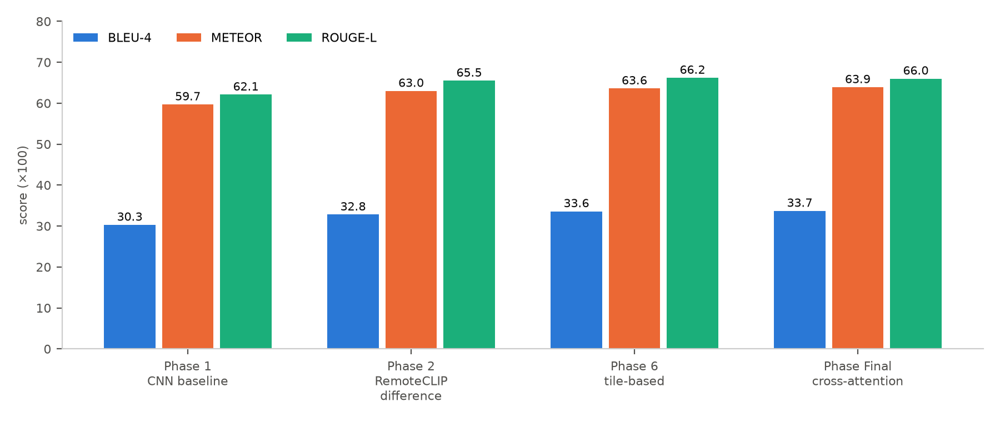
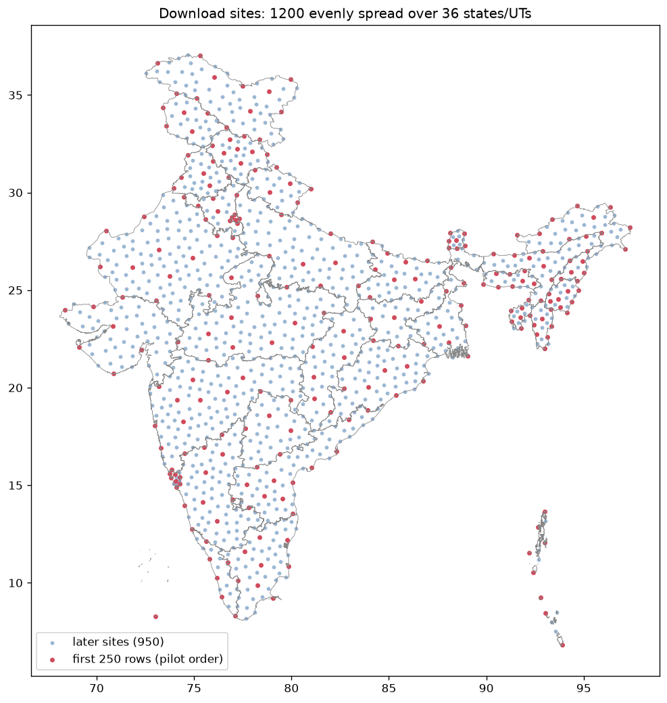
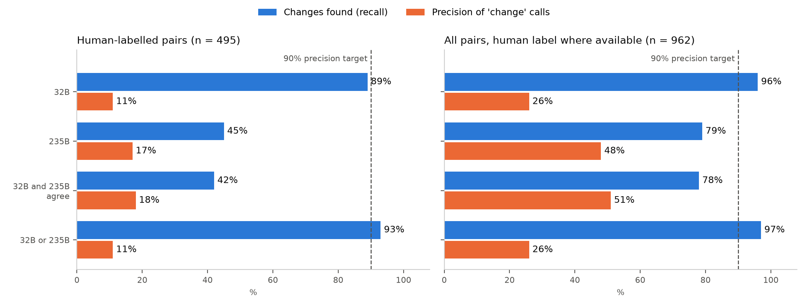
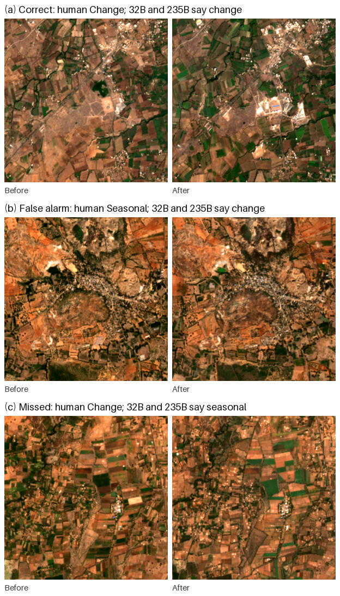

# Remote Sensing Image Change Caption Generation — Consolidated Report

*Project overview, experiment timeline and findings, July – October 2026*

**[Author names]** · **[Affiliation]** · October 2026

---

## Abstract

This report consolidates the full project on remote sensing image change captioning (RSICC) for Indian imagery. It covers three parts:

- **Part A (July–August):** we built a modular captioning pipeline on the LEVIR-CC benchmark and developed it through four architectures, improving BLEU-4 from 30.3 to 33.7. Attempts to extend it beyond LEVIR-CC failed. Sequential fine-tuning on SECOND-CC caused catastrophic forgetting, and designs with large language-model decoders could not be trained to completion.
- **Part B (September):** a pilot Indian Sentinel-2 collection was captioned with off-the-shelf vision-language models, which produced unusable output.
- **Part C (September–October):** we built an India-wide dataset of 15,610 quality-screened Sentinel-2 patch pairs and evaluated whether open-weight vision-language models could label land-use change automatically. Across prompting strategies, visual assistance, model sizes and a 1,000-pair validation against human labels, the best rule was correct on at most about half of its change calls.

**We conclude that neither transfer from LEVIR-CC nor automatic labelling with current vision-language models yields reliable change captions for Indian 10 m imagery, and that scaling either approach would produce a dataset of unacceptably poor quality.**

---

## 1. Introduction

Remote sensing image change captioning describes, in natural language, what changed between two satellite images of the same place. Public RSICC datasets such as LEVIR-CC use sub-metre imagery of a few foreign regions. India's freely available imagery is medium-resolution (Sentinel-2, 10 m), and its landscapes are dominated by smallholder farmland, monsoon-driven seasonal cycles, haze and dense organic settlements.

The project aimed at a change captioning system for Indian imagery. It moved through three parts, each motivated by the failure of the previous one:

| Part | Question | Outcome |
|---|---|---|
| A | Can a model trained on LEVIR-CC be improved and adapted to new data? | Improves on LEVIR-CC, but does not transfer |
| B | Can existing vision-language captioners caption Indian imagery directly? | No: empty, garbled or "nothing changed" output |
| C | Can we build an Indian dataset and label it automatically with vision-language models? | Dataset built; automatic labels too inaccurate to use |

## 2. Project timeline

| Date (2026) | Part | Work | Result |
|---|---|---|---|
| 2 Jul | A | Phase 1: modular pipeline and CNN baseline on LEVIR-CC | BLEU-4 30.3, ROUGE-L 62.1 |
| 7–9 Jul | A | Phase 2: frozen RemoteCLIP encoder with difference fusion | BLEU-4 32.8; largest single gain |
| 9–10 Jul | A | Final model: RemoteCLIP cross-attention + contrastive alignment | BLEU-4 33.7 |
| 12–28 Jul | A | Phase 6: hierarchical tile-based model | BLEU-4 33.6 |
| Jul | A | Sequential fine-tuning on SECOND-CC (Phase 6 and Final models) | Catastrophic forgetting: LEVIR-CC BLEU-4 fell to 12–15 |
| 30 Jul – 1 Aug | A | Phases 7–8: tile-difference variants and hyperparameter changes | Marked failed; degraded |
| 2–20 Aug | A | CodeAug / Phase 8: RemoteCLIP + Q-Former / bridge + Qwen language-model decoder | Stage-2 loss diverged to NaN; no evaluation completed |
| 9–10 Sep | B | Pilot Indian Sentinel-2 collection; TeoChat and Qwen2.5-VL captioning | 1,072 pairs kept; captions unusable |
| mid-Sep | C | Prototype: change heatmaps and a two-stage VLM captioner on a few sites | Captioner dismissed a real localized change; selection problems found |
| 27 Sep | C | All-India downloader, 1,200-site registry, pilot | Resumable downloader; quality checks added |
| 28 Sep | C | Haze screen trial on the GPU cluster | 4-bit 8B model chosen for speed |
| 28–29 Sep | C | Full dataset: download, patching, screening | 15,610 accepted patch pairs |
| 29 Sep | C | Diagnosis of failed captions; perception test of four models | Seasonal change mistaken for land-use change |
| 30 Sep | C | Change gate (pixel and CNN features) and two-model triage trial | Strict triage found only 7 of 15 changes |
| 1 Oct | C | Prompting with and without assistance; teammate's change-map method | Boxes halve detection; forcing prompts and maps invent change |
| 1–2 Oct | C | 1,000-pair validation; blind human review of 535 pairs | Best rule correct on at most about half of its change calls |

## 3. Part A — LEVIR-CC models (July–August)

**3.1 Pipeline.** All models shared one codebase, so their results are comparable:

- the official LEVIR-CC splits
- a single vocabulary
- caption cross-entropy loss
- Adam with learning rate 1×10⁻⁴ and a cosine schedule
- evaluation on all 1,929 test pairs

**3.2 Architectures and results (LEVIR-CC test set):**

| Model | Description | BLEU-4 | METEOR | ROUGE-L |
|---|---|---|---|---|
| Phase 1 | Two-stream CNN encoder + Transformer decoder | 30.3 | 59.7 | 62.1 |
| Phase 2 | Frozen RemoteCLIP ViT-B/32, difference fusion | 32.8 | 63.0 | 65.5 |
| Phase 6 | Tile-based RemoteCLIP with tile fusion | 33.6 | 63.6 | 66.2 |
| Final | RemoteCLIP cross-attention + contrastive alignment | 33.7 | 63.9 | 66.0 |

*Figure 1. LEVIR-CC test scores per architecture.*

A remote-sensing-pretrained encoder gave the largest single gain, and further complexity added little.

**3.3 Cross-dataset extension.** Sequential fine-tuning on SECOND-CC erased most of the LEVIR-CC performance (Figure 2), while SECOND-CC scores stayed low (BLEU-4 12–13). Language-model decoders (Qwen2-VL-2B, Qwen2-0.5B) were implemented, but training diverged to NaN in half precision, and no evaluation was completed.

*Figure 2. LEVIR-CC test scores before and after sequential fine-tuning on SECOND-CC.*

## 4. Part B — Off-the-shelf captioners on Indian imagery (September)

A pilot Sentinel-2 collection over hand-picked Indian areas kept 1,072 of 2,126 tiles. Two pretrained captioners were run on a 30-pair sample:

- **TeoChat** answered "Nothing meaningful changed" for 27 of 30 pairs.
- **Qwen2.5-VL** produced empty or garbled output for many pairs. When it did answer, it described generic urban development (Figure 3).

*Figure 3. One Indian pair with both captioners' answers. Neither describes the specific change visible on the right.*

## 5. Part C — India-wide dataset and automatic labelling (September–October)

**5.1 Dataset.**
- **Sites:** 1,200 sites spread evenly over all 36 states and union territories (Figure 4).
- **Imagery:** Sentinel-2 Collection-1 true colour at 10 m, with before (2019–20) and after (2025–26) images taken in matching dry-season windows.
- **Quality control:** block-level cloud, snow and water limits, haze and whiteout checks, alignment checks, patch-level screening, and a haze screen run on the GPU cluster.
- **Result:** 27,888 patch pairs, of which **15,610 were accepted**.

*Figure 4. Site coverage across India.*

**5.2 Reference labels.** A web-based review tool shows the before and after images with a blink view. A human annotator labelled 535 pairs blind, choosing change, seasonal, no change or can't tell. The pairs were those where the automatic labels disagreed, plus a random sample where they agreed.

**5.3 Prompting experiments.**
- **Without assistance:** constrained, neutral and free-form prompts all shifted the balance between missed and false changes, but none removed the confusion between seasonal and lasting change.
- **With assistance:** neutral region boxes, whether from pixel differences or CNN features, roughly halved detection (Figure 5). A forcing prompt invented change on 12 of 15 identical-image pairs. A rule-based change map marked a median 82% of each image as changed and led the model to report change on every pair (Figure 6).

*Figure 5. A human-confirmed change, found with the plain prompt but missed once region boxes are added.*

*Figure 6. Rule-based change map on a pair the human labelled seasonal.*

**5.4 1,000-pair validation.** The free-form question was put to Qwen3-VL-32B and Qwen3-VL-235B on 1,002 pairs (API cost USD 1.00).

| Decision rule | Human-labelled pairs (n = 495): found / precision | All pairs (n = 962): found / precision |
|---|---|---|
| 32B | 89% / 11% | 96% / 26% |
| 235B | 45% / 17% | 79% / 48% |
| 32B and 235B agree | 42% / 18% | 78% / 51% |

*Figure 7. Changes found and precision of "change" calls for each rule, against the 90% precision needed for automatic labelling.*

*Figure 8. Validation examples with the human label as ground truth: (a) correct, (b) false alarm, (c) missed change.*

Real change appears in only about one pair in seven, so even a low false-change rate produces as many false "change" labels as true ones. Automatic labelling was therefore rejected as a source for the dataset.

## 6. Cross-cutting findings

1. **Data is the bottleneck, not architecture.** On LEVIR-CC, architectural changes beyond a pretrained encoder brought diminishing returns. For India, no suitable labelled data existed, and none of the attempts to create it automatically produced reliable labels.
2. **Seasonal change is the central failure.** Every model, from LEVIR-CC-trained captioners to Qwen3-VL-235B, confused crop cycles, greenness, water level and haze with lasting land-use change.
3. **Hints and forced prompts are harmful.** Telling a model where or that something changed either narrows its attention or makes it invent change. This held in the early two-stage captioner, in the region-box tests and in the change-map method.
4. **Adaptation by fine-tuning is fragile.** Sequential fine-tuning destroyed source-domain performance without delivering target-domain quality.
5. **Compute shaped the project.** The institute cluster provided one older GPU at a time without bfloat16 support. It limited model size, forced aggressive quantisation, caused numerical failures and was unreachable during the final experiments.

## 7. Limitations

- LEVIR-CC scores use one reference caption per image, so they are comparable across our models but not with published results.
- The language-model decoder designs never completed an evaluation run.
- Off-the-shelf captioners were checked on only 30 Indian pairs, without reference captions.
- At 10 m resolution, much land-use change is at or below the limit of what can be seen.
- The human-labelled evaluation set comes from a single annotator and is weighted toward difficult pairs. The remaining reference labels carry an estimated error of about 20%.
- The prompting experiments used 40–135 pairs each, so their numbers carry wider uncertainty than the 1,000-pair validation.

## 8. Conclusion

Over four months we built a reproducible RSICC pipeline on LEVIR-CC and an India-wide, quality-screened Sentinel-2 dataset of 15,610 patch pairs. We tested three routes to Indian change captioning:

- transferring LEVIR-CC models
- applying off-the-shelf vision-language captioners
- labelling the new dataset automatically with open-weight vision-language models

All three failed for the same underlying reason: no available model reliably tells lasting land-use change from seasonal variation in medium-resolution Indian imagery. Scaling any of these pipelines would produce a large dataset of poor quality. Reliable change labels for this setting still require human annotation, and the dataset, tooling and evaluation protocol built here provide the base for that work.

---

*Detailed reports: Phase 1 (LEVIR-CC and adaptation) and the Indian dataset report, provided separately.*
