

# Remote Sensing Image Change Caption Generation

## Evidence Report — Predictions, Curves, Maps and Plots

**Independent Study, Monsoon 2026**

| | |
|---|---|
| **Team** | Sankalp Chaturvedi (2025201083) |
| | KSPSVLN Siddardha Kumar Kavuri (2025201061) |
| | Rinkesh Verma (2025201070) |
| **Mentor** | Rama Chandra Prasad |

*This report collects the evidence behind the observations in the Main Report. Each section names the observation it supports (Obs. 1–15).*

## How to read this report

- **Sources.**
    - Captioning results come from the notebook outputs of the [project repository](https://github.com/Sankalp0109/Generative-and-Caption-Based-Vision-Language-Models-for-Remote-Sensing-Change-Detection).
    - Prediction samples come from the saved prediction sheets, published as [RSICC Model Run Reports](https://www.kaggle.com/datasets/kspsvlnsiddardha/rsicc-model-run-reports) on Kaggle.
    - The Indian-dataset evidence comes from the experiment logs and the labelled files, published as [India Sentinel-2 Change Pairs](https://www.kaggle.com/datasets/kspsvlnsiddardha/india-sentinel2-change-pairs) and its [labelled subset](https://www.kaggle.com/datasets/kspsvlnsiddardha/india-sentinel2-change-labelled).
- **Ground truth for Part C** is the human label where one exists.
- **Prediction-sheet naming.** The sheets named `predictions_phase7*` contain Phase 6 model outputs. They are labelled "Phase 6 run" here.

---

## Part A — Captioning models on LEVIR-CC and SECOND-CC

### E-A1. Scores per model on LEVIR-CC test (Obs. 1, 2)

| Model | Loss | BLEU-1 | BLEU-2 | BLEU-3 | BLEU-4 | METEOR | ROUGE-L | Cosine |
|---|---|---|---|---|---|---|---|---|
| Phase 1 baseline | 0.9690 | 0.4720 | 0.3855 | 0.3393 | 0.3027 | 0.5966 | 0.6214 | 0.6477 |
| Phase 2 RemoteCLIP difference | 0.9345 | 0.5168 | 0.4237 | 0.3712 | 0.3284 | 0.6304 | 0.6545 | 0.7061 |
| Final cross-attention | 0.8982 | 0.5311 | 0.4355 | 0.3810 | 0.3365 | 0.6392 | 0.6604 | 0.7123 |
| Phase 6 tiles | 0.9225 | 0.5214 | 0.4297 | 0.3777 | 0.3358 | 0.6357 | 0.6624 | 0.7149 |
| Phase 8 stage 1a (epoch 7) | — | 0.5092 | 0.4167 | 0.3658 | 0.3250 | 0.6155 | 0.6482 | 0.7007 |
| Phase 8 stage 1b (Qwen bridge) | — | 0 | 0 | 0 | 0 | 0 | 0 | 0.0104 |

**Phase 1 to Phase 2** (encoder only changed, 3.41 M vs 3.43 M trainable parameters):

- BLEU-1 to BLEU-4: +8.5% to +9.9% relative
- METEOR +5.7%, ROUGE-L +5.3%, cosine +9.0%
- test loss −3.6%

### E-A2. Training and validation curves (Obs. 3, 6)

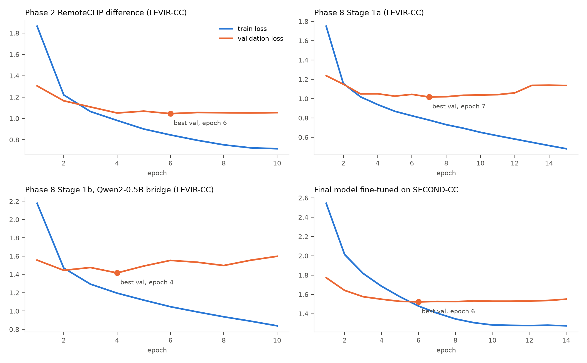

In every run, validation loss reaches its minimum early while training loss keeps falling:

| Run | Best validation loss | Final validation loss | Final training loss |
|---|---|---|---|
| Phase 2 | 1.045 (epoch 6) | 1.054 (epoch 10) | 0.716 |
| Phase 8, stage 1a | 1.017 (epoch 7) | 1.136 (epoch 15) | 0.482 (training accuracy 84.9%) |
| Phase 8, stage 1b | 1.417 (epoch 4) | 1.598 (epoch 10) | — |
| SECOND-CC fine-tuning | 1.522 (epoch 6) | 1.551 (epoch 14) | — |

### E-A3. Forgetting after SECOND-CC fine-tuning (Obs. 6)

| Model | LEVIR-CC loss | BLEU-4 | METEOR | ROUGE-L | Cosine |
|---|---|---|---|---|---|
| Final, before fine-tuning | 0.898 | 0.337 | 0.639 | 0.660 | 0.712 |
| Final, after fine-tuning | 4.080 | 0.149 | 0.394 | 0.437 | 0.458 |
| Phase 6, before fine-tuning | 0.923 | 0.336 | 0.636 | 0.662 | 0.715 |
| Phase 6, after fine-tuning | 3.520 | 0.121 | 0.318 | 0.374 | 0.438 |

### E-A4. Domain shift to SECOND-CC (Obs. 5)

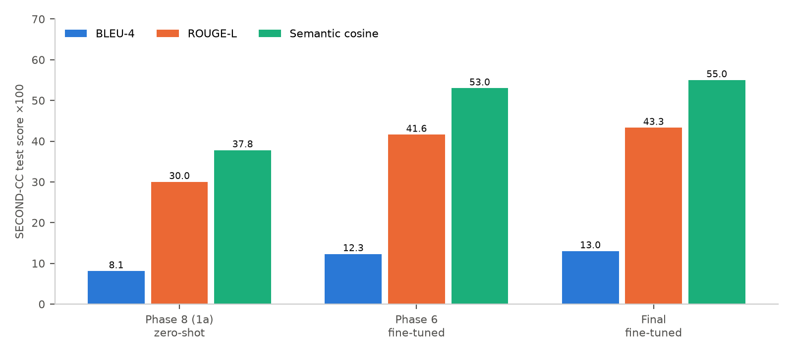

| Model / condition | BLEU-1 | BLEU-4 | METEOR | ROUGE-L | Cosine |
|---|---|---|---|---|---|
| Phase 8 stage 1a, zero-shot | 0.179 | 0.081 | 0.298 | 0.300 | 0.378 |
| Phase 6, fine-tuned | 0.354 | 0.123 | 0.392 | 0.416 | 0.530 |
| Final, fine-tuned | 0.363 | 0.130 | 0.413 | 0.433 | 0.550 |

The zero-shot and fine-tuned rows come from different models, so this comparison is indicative.

### E-A5. The same LEVIR-CC test pairs across three runs (Obs. 4, 7)

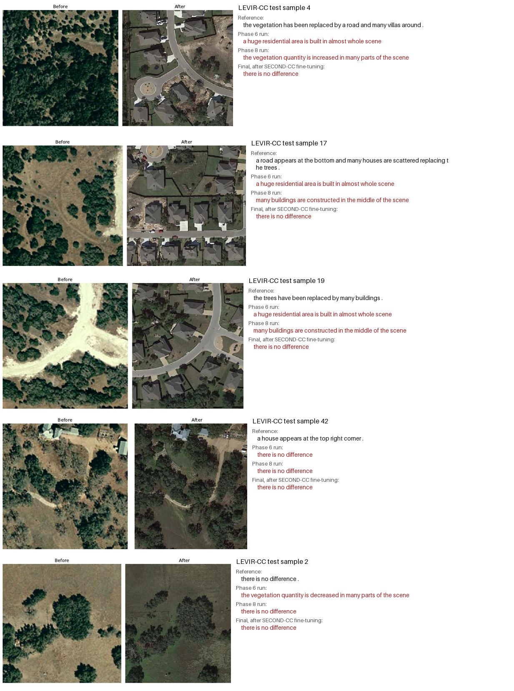

**Sample 4, 17 and 19** (forest or scrub replaced by a housing estate):

- The Phase 6 run gives a template ("a huge residential area is built…").
- The Phase 8 run partly contradicts the scene ("vegetation quantity is increased").
- The Final model after fine-tuning says "there is no difference".

**Sample 42** (one house added at the top right): all three runs miss it.

**Sample 2** (no change): the Phase 6 run reports vegetation loss.

### E-A6. Prediction behaviour across 300 saved LEVIR-CC samples (Obs. 4, 7)

| Prediction sheet | Changed pairs called "no difference" | Unchanged pairs correct | Distinct captions |
|---|---|---|---|
| Phase 6 run | 43 / 164 | 98 / 136 | 21 |
| Phase 8 run | 31 / 164 | 96 / 136 | 32 |
| Final after SECOND-CC fine-tuning | **164 / 164** | 136 / 136 | **1** |
| References | — | — | 163 |

On the SECOND-CC prediction sheets (300 samples, 255 changed), the Phase 6 and Phase 8 runs produced 97 and 82 distinct captions. They missed 16 and 19 changed pairs, and called 12 and 15 of 45 unchanged pairs changed.

### E-A7. SECOND-CC test predictions (Obs. 5)

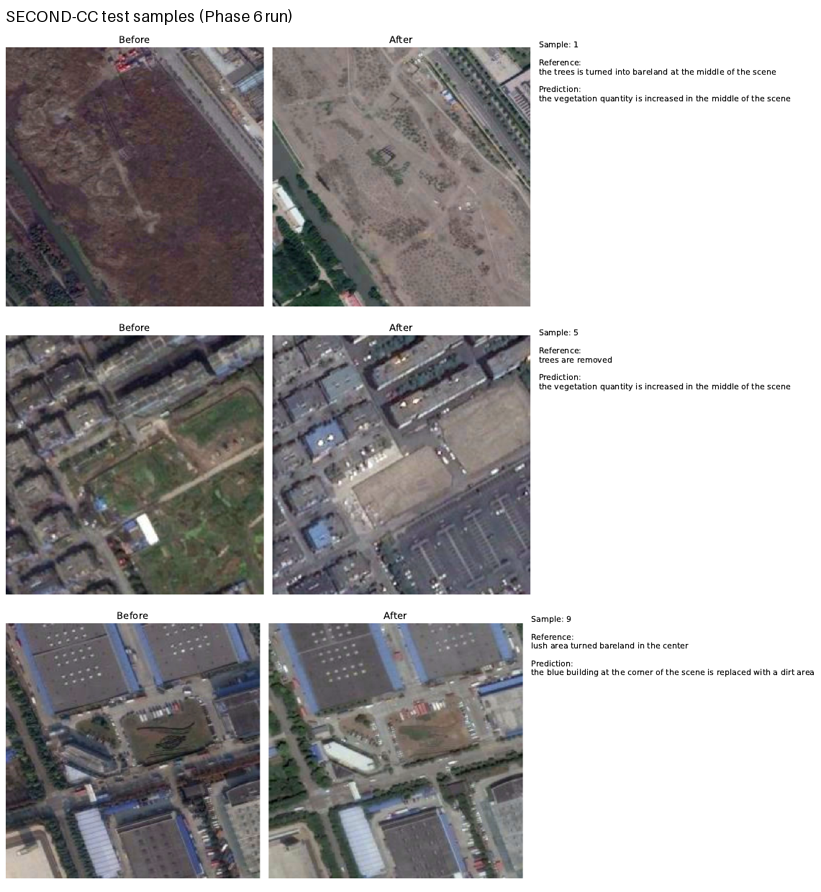

### E-A8. Whole-image vs patch-wise inference on unlabelled high-resolution pairs (Obs. 9)

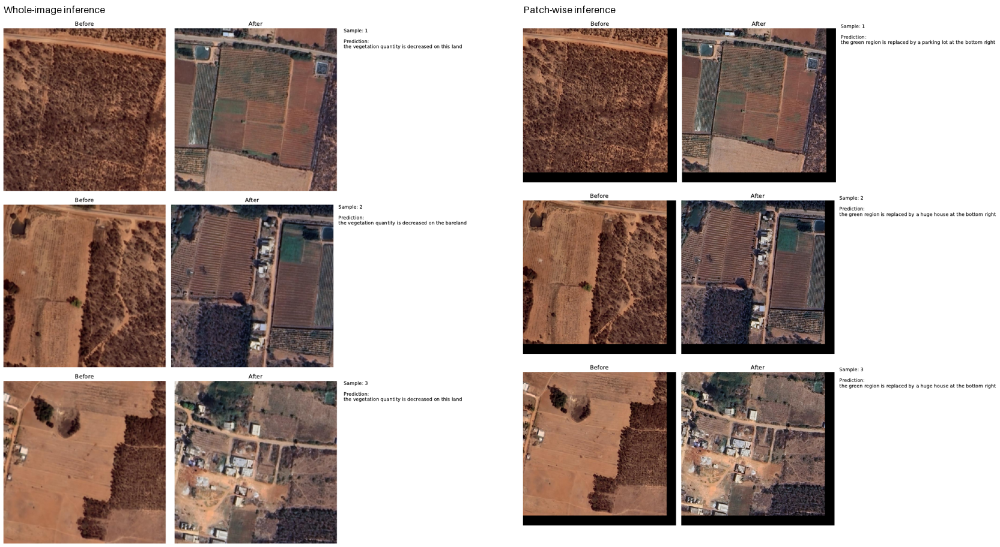

These 43 pairs have no reference captions. In the samples shown, the after images contain new farm structures and buildings.

- **Whole-image inference** (23 distinct captions) mostly reports "vegetation quantity is decreased".
- **Patch-wise inference** (9 distinct captions) gives "the green region is replaced by a huge house at the bottom right" for 75% of pairs, regardless of where the change is.

---

## Part B — Off-the-shelf captioners on Indian imagery

### E-B1. Pilot Indian Sentinel-2 collection

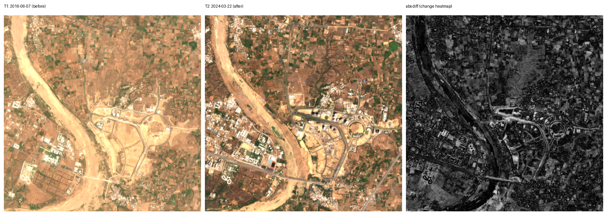

60 areas of interest in 5 categories, tiled into 512×512 patches and filtered by change magnitude. Of 2,126 tiles checked, 1,072 pairs were kept, in 1 h 53 min with 12 workers.

### E-B2. Captioner outputs (Obs. 10)

| Captioner (30 pairs) | Outcome |
|---|---|
| TeoChat | "Nothing meaningful changed" on 27/30; one invented hurricane-damage description |
| TeoChat, 4-bit | "Nothing meaningful changed" on 23/30 |
| Qwen2.5-VL, first run | 11 empty and 12 garbled answers (non-English text, repeated tokens) |
| Qwen2.5-VL, retries / 8-bit | Failures reduced but not removed; answers describe generic urban development |

---

## Part C — India-wide dataset and automatic labelling

### E-C1. Site coverage

### E-C2. Screening outcome (Obs. 11)

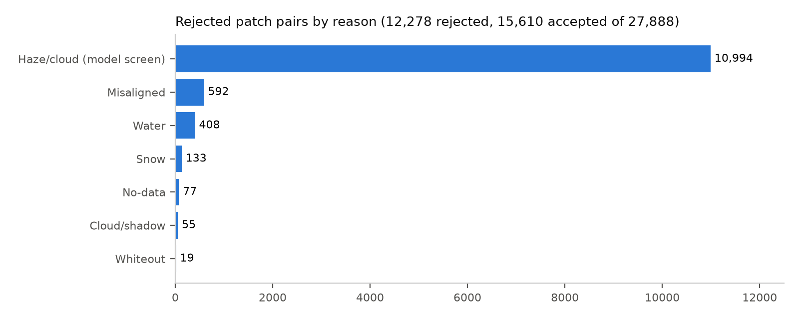

### E-C3. Haze screen trial, 100 pairs (Obs. 11)

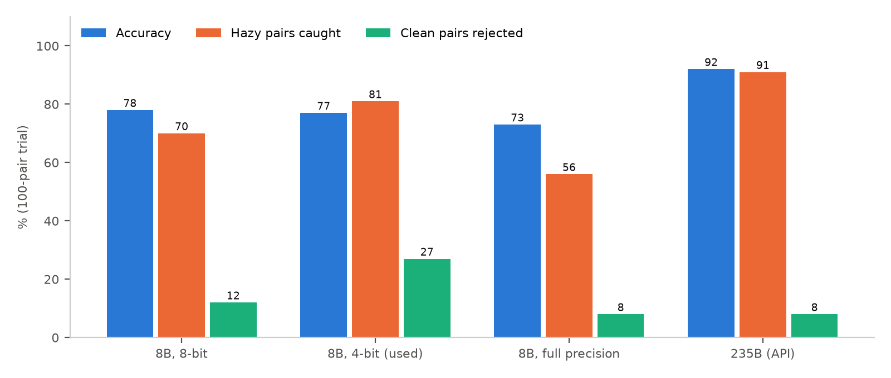

The 4-bit model was used for the full run because it was 8× faster on the cluster GPU (1.4 s per pair). The cost was a 27% wrong-reject rate on clean pairs. The reference labels for this trial were re-checked at large size using the 235B model as a second opinion, which favours the 235B row; its accuracy should be read as an upper bound.

### E-C4. Label classes and human review (Obs. 12)

| | Change | Seasonal | No change | Can't tell | Total |
|---|---|---|---|---|---|
| Human-labelled (blind) | 55 | 214 | 226 | 40 | 535 |
| All labelled pairs | 143 | 400 | 383 | 76 | 1,002 |

- The human agreed with the automatic suggestion on 84% of reviewed pairs.
- In a random sample of 45 pairs where everything agreed, the human disagreed on 9: 4 changes everyone missed, and 5 false changes everyone accepted.

### E-C5. Model size comparison (Obs. 13)

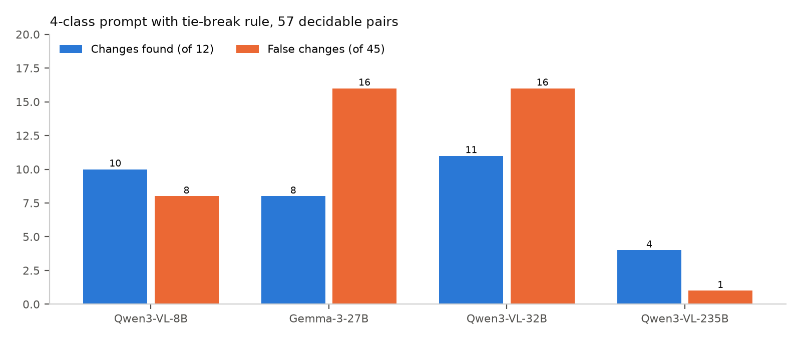

Asked plainly, the 235B dismissed real construction as "seasonal or agricultural variation" in most missed cases. The 32B over-called change.

### E-C6. Effect of region hints and forcing prompts (Obs. 14)

The no-hint baseline used the 4-class prompt, while the boxed variants used a per-box prompt; the box variants are directly comparable with each other. With region boxes, the model's overall answer matched its answer for the boxes. It never reported a change outside the boxes, even when asked to.

### E-C7. Example: region boxes hide a real change (Obs. 14)

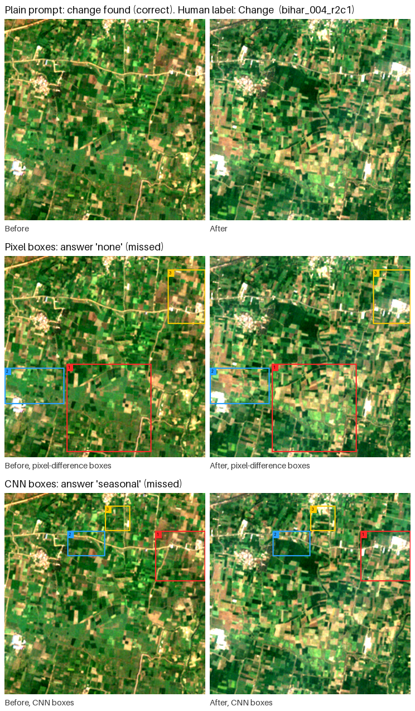

### E-C8. Rule-based change map (Obs. 14)

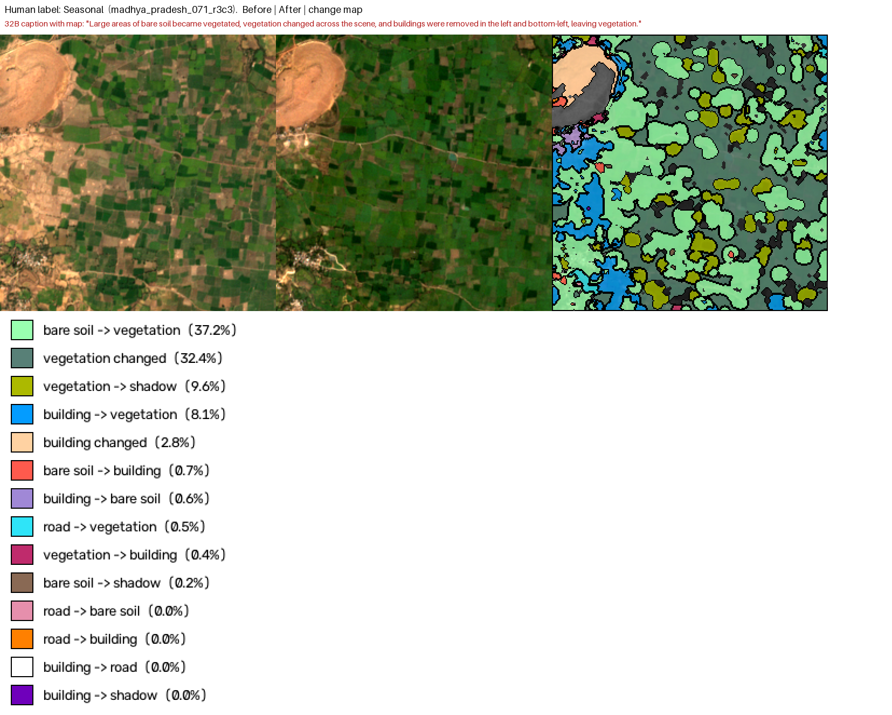

On 50 pairs, the map marked a median 82% of each image as changed (maximum 98%). With the map treated as fact, the model reported change on 19/19 real-change pairs and on 27/27 no-change pairs.

### E-C9. Pixel and CNN feature change gate

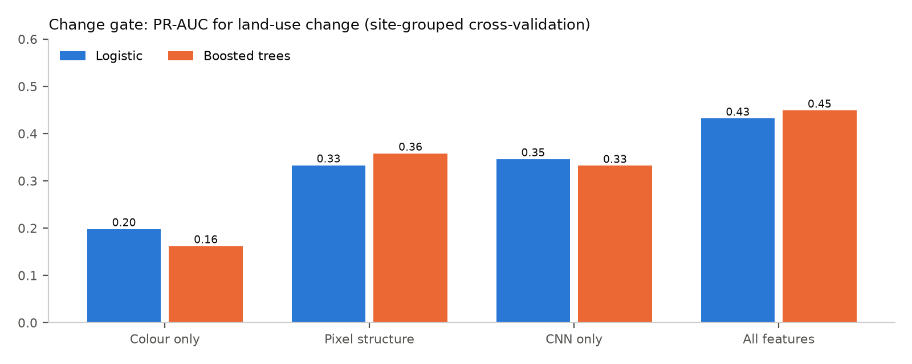

At 90% recall the gate keeps about 62% of pairs, so it can only rank pairs, not label them.

### E-C10. 1,000-pair validation (Obs. 15)

**Human-labelled set (n = 495), with 95% Wilson intervals:**

| Rule | Changes found | Precision | False-change rate |
|---|---|---|---|
| 32B | 89% (78–95) | 11% (9–15) | 87% (84–90) |
| 235B | 45% (33–58) | 17% (12–24) | 27% (23–32) |
| Both agree | 42% (30–55) | 18% (12–25) | 24% (21–29) |

**How often each model said "change", by human label:**

| Human label | 32B says change | 235B says change |
|---|---|---|
| Seasonal (n = 214) | 200 (93%) | 67 (31%) |
| No change (n = 226) | 184 (81%) | 53 (23%) |
| Change (n = 55) | 49 (89%) | 25 (45%) |

### E-C11. Validation examples (Obs. 13, 15)

The 235B's conclusions in its own words:

- **(a) Correct, human label Change:** *"There has been significant, lasting development, including new buildings, roads, and land clearing."*
- **(b) False alarm, human label Seasonal:** *"Lasting changes have occurred, including new agricultural plots, possible expansion of settlement."*
- **(c) Missed, human label Change:** *"The differences are not lasting structural changes. They are consistent with seasonal or annual agricultural cycles."*

---

## Resources

| Resource | Link |
|---|---|
| Code repository | [github.com/Sankalp0109/Generative-and-Caption-Based-Vision-Language-Models-for-Remote-Sensing-Change-Detection](https://github.com/Sankalp0109/Generative-and-Caption-Based-Vision-Language-Models-for-Remote-Sensing-Change-Detection) |
| India Sentinel-2 Change Pairs (15,610 pairs) | [kaggle.com/datasets/kspsvlnsiddardha/india-sentinel2-change-pairs](https://www.kaggle.com/datasets/kspsvlnsiddardha/india-sentinel2-change-pairs) |
| Labelled subset (1,002 pairs) | [kaggle.com/datasets/kspsvlnsiddardha/india-sentinel2-change-labelled](https://www.kaggle.com/datasets/kspsvlnsiddardha/india-sentinel2-change-labelled) |
| Model run reports (prediction sheets) | [kaggle.com/datasets/kspsvlnsiddardha/rsicc-model-run-reports](https://www.kaggle.com/datasets/kspsvlnsiddardha/rsicc-model-run-reports) |
| Model checkpoints | [kaggle.com/models/kspsvlnsiddardha/rsicc-change-captioning](https://www.kaggle.com/models/kspsvlnsiddardha/rsicc-change-captioning) · [huggingface.co/Kspsvln/IS](https://huggingface.co/Kspsvln/IS) |

Datasets, models and metrics are cited in the References of the Main Report. Contains modified Copernicus Sentinel data (2019–2026).
