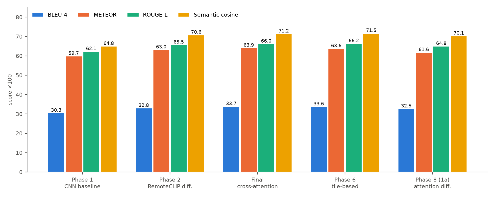
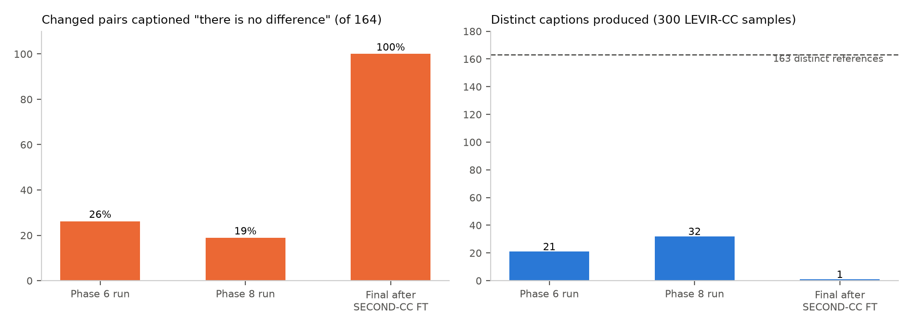
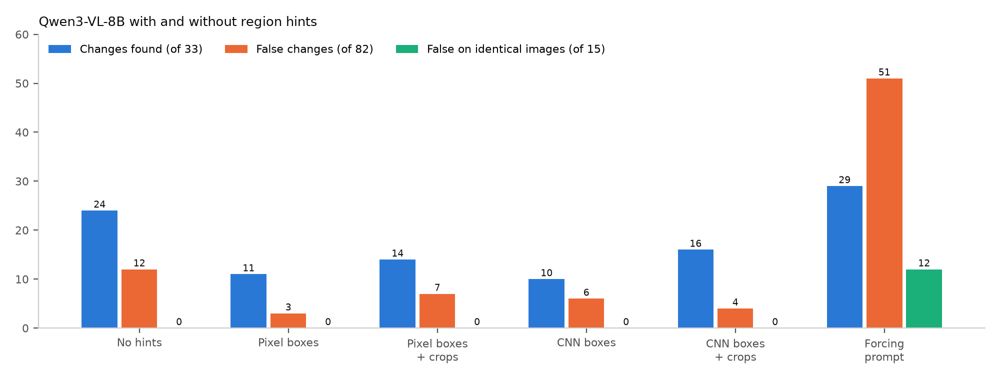

# Remote Sensing Image Change Caption Generation

## Final Report — Observations and Conclusions

**Independent Study, Monsoon 2026**

| | |
|---|---|
| **Team** | Sankalp Chaturvedi (2025201083) |
| | KSPSVLN Siddardha Kumar Kavuri (2025201061) |
| | Rinkesh Verma (2025201070) |
| **Mentor** | Rama Chandra Prasad |

*A companion Evidence Report contains the predictions, training curves, maps and plots that support every observation here (cross-referenced as E-figures).*

## Abstract

We studied remote sensing image change captioning (RSICC): generating a sentence describing what changed between two satellite images of the same place. The project had three parts.

- **Part A (LEVIR-CC models, July–August).** We built a modular pipeline and compared seven model designs. A frozen, remote-sensing-pretrained encoder (RemoteCLIP [3], a CLIP [4] model) was the single most valuable change, raising BLEU-4 from 0.303 to 0.328. More elaborate fusion added at most 0.009 BLEU-4. Fine-tuning on a second dataset (SECOND-CC) caused catastrophic forgetting: the final model then captioned every changed LEVIR-CC test pair as "there is no difference". Language-model decoders produced NaN losses and, once stabilised, degenerate output.
- **Part B (Indian pilot, September).** Off-the-shelf captioners were run on Indian Sentinel-2 pairs. Their output was unusable: either "nothing changed" for almost everything, or empty and garbled text.
- **Part C (Indian dataset, September–October).** We built an India-wide dataset of 15,610 quality-screened Sentinel-2 pairs and tested whether vision-language models could label it automatically. Across prompts, visual hints, model sizes and a 1,000-pair validation against human labels, the best rule was correct on at most about half of its change calls.

**Conclusion.** Neither transfer from existing datasets nor automatic labelling yields reliable change captions for Indian imagery. Scaling either approach would produce a poor-quality dataset; reliable labels require human annotation.

---

## 1. Problem and approach

Most RSICC benchmarks, such as LEVIR-CC [1] (10,077 pairs of 0.5 m imagery from Texas, USA), contain planned suburban scenes. Indian imagery differs in two ways that matter for captioning:

- **Dense, irregular settlements** with varied roofing.
- **Strong seasonal colour change** between dry and monsoon seasons, which a model can mistake for construction or demolition.

The project proceeded as a sequence of controlled experiments. Each step changed one component and was evaluated with the same metrics, and each failure motivated the next step.

| Part | Period (2026) | Question | Answer |
|---|---|---|---|
| A | Jul–Aug | Which architecture works best on LEVIR-CC, and does it transfer? | The encoder matters most; transfer by fine-tuning causes forgetting |
| B | Sep | Can existing captioners describe Indian imagery? | No |
| C | Sep–Oct | Can we build an Indian dataset and label it automatically? | Dataset built; automatic labels are too inaccurate |

**Evaluation.**

- **Captioning:** BLEU-1–4, METEOR, ROUGE-L and sentence-embedding cosine similarity on the full LEVIR-CC test set (1,929 pairs) and the SECOND-CC [2] test set (1,227 pairs), using BLEU [10], METEOR [11], ROUGE-L [12] and Sentence-BERT embeddings [14].
- **Indian labelling:** recall and precision of "change" calls against blind human labels.

The pipeline also computed a simplified CIDEr-like score. It is not comparable to published CIDEr [13], so we do not report it.

## 2. Part A — Captioning models on LEVIR-CC

### 2.1 Models

| Model | Key idea | Trainable / total params |
|---|---|---|
| Phase 1 baseline | CNN encoder trained from scratch + 2-layer Transformer decoder | 3.41 M |
| Phase 2 | Frozen RemoteCLIP [3] ViT-B/32 + difference fusion, same decoder | 3.43 M / 154.7 M |
| Final | RemoteCLIP + cross-attention between dates + contrastive alignment | 9.11 M / 160.4 M |
| Phase 6 | 2×2 tiles, per-tile cross-attention, tile-fusion Transformer, contrastive loss | 13.84 M / 165.1 M |
| Phase 8, stage 1a | RemoteCLIP + attention difference module + light decoder | 6.29 M / 157.6 M |
| Phase 8, stage 1b | Stage 1a features bridged into a frozen Qwen2-0.5B language model [5] | 5.12 M / 650.4 M |
| Phase 7 (CodeAug) | RemoteCLIP ViT-L/14 + LoRA [16] + Q-Former [17] + 4-bit [18] Qwen2-VL-2B [5], vegetation-index masking | 9.81 M / 1.86 B (design only) |

### 2.2 Results on LEVIR-CC test (n = 1,929)

| Model | Test loss | BLEU-1 | BLEU-4 | METEOR | ROUGE-L | Cosine |
|---|---|---|---|---|---|---|
| Phase 1 baseline | 0.969 | 0.472 | 0.303 | 0.597 | 0.621 | 0.648 |
| Phase 2 RemoteCLIP | 0.935 | 0.517 | 0.328 | 0.630 | 0.655 | 0.706 |
| **Final** | **0.898** | **0.531** | **0.337** | **0.639** | 0.660 | 0.712 |
| Phase 6 tiles | 0.923 | 0.521 | 0.336 | 0.636 | **0.662** | **0.715** |
| Phase 8, stage 1a | — | 0.509 | 0.325 | 0.616 | 0.648 | 0.701 |
| Phase 8, stage 1b (Qwen) | — | 0 | 0 | 0 | 0 | 0.010 |
| Phase 7 CodeAug | no valid result | | | | | |

*Figure 1. LEVIR-CC test scores per model (Evidence E-A1).*

**Observations.**

- **Obs. 1 — The encoder is what matters.** Swapping the from-scratch CNN for frozen RemoteCLIP at equal trainable capacity improved every metric: BLEU-4 +8.5%, cosine +9.0%, test loss −3.6%. Only the encoder changed, so the gain is attributable to it.
- **Obs. 2 — Fusion complexity brings diminishing returns.** Cross-attention, tiles and the attention difference module added at most 0.009 BLEU-4 over Phase 2, while needing up to four times the trainable parameters. With a single seed per model, the differences between Final and Phase 6 are not significant.
- **Obs. 3 — The models overfit quickly.** Validation loss bottoms out at epoch 6–7 while training loss keeps falling (E-A2), so early stopping on validation loss is essential.
- **Obs. 4 — The models rely on templates.** On a 300-sample prediction set, the Phase 6 and Phase 8 runs produced only 21 and 32 distinct captions, against 163 distinct references (E-A6). They capture "something was built" but rarely say what or where (E-A5).

*Figure 2. Prediction behaviour on 300 saved LEVIR-CC test samples (Evidence E-A6).*

> **Experiment conclusion.** A pretrained remote-sensing encoder is the right foundation; once it is in place, the fusion design hardly matters, and all models rely on a small set of template captions.
>
> **Why the next experiment.** LEVIR-CC covers planned suburbs in a single region, while our target is Indian imagery. Before building anything new, we needed to know whether these models transfer to another dataset at all, so we evaluated them on SECOND-CC [2] and fine-tuned on it.

### 2.3 Domain shift and forgetting (SECOND-CC)

| Condition | SECOND-CC BLEU-4 | SECOND-CC cosine | LEVIR-CC BLEU-4 after |
|---|---|---|---|
| Phase 8 (1a), zero-shot | 0.081 | 0.378 | — |
| Phase 6, fine-tuned on SECOND-CC | 0.123 | 0.530 | 0.336 → **0.121** |
| Final, fine-tuned on SECOND-CC | 0.130 | 0.550 | 0.337 → **0.149** |

**Observations.**

- **Obs. 5 — The domain shift is severe.** Zero-shot BLEU-4 drops about 75% relative to LEVIR-CC.
- **Obs. 6 — Fine-tuning helps the new domain but erases the old one.** SECOND-CC improves, but LEVIR-CC BLEU-4 falls by 56–64% and test loss rises from about 0.9 to 3.5–4.1 (E-A3).
- **Obs. 7 — After fine-tuning, the Final model collapsed to a single caption.** On the 300 saved LEVIR-CC test samples, it produced only "there is no difference", including for all 164 changed pairs (E-A5, E-A6).

*Figure 3. LEVIR-CC scores before and after SECOND-CC fine-tuning (Evidence E-A3).*

   SECOND-CC validation loss was lowest at epoch 6 and rose afterwards (E-A2), so fine-tuning was run too long at too high a learning rate. A lower-rate, shorter configuration was defined afterwards but not evaluated.

> **Experiment conclusion.** Small captioners trained on one dataset do not transfer: zero-shot quality collapses, and fine-tuning trades the old domain for a modest gain on the new one.
>
> **Why the next experiment.** Catastrophic forgetting [24] suggested that a small decoder trained from scratch has too little general language knowledge to adapt. A pretrained language model might generalise better, so we replaced the decoder with Qwen-family language models.

### 2.4 Language-model decoders

- **Obs. 8 — The language-model decoders did not work.**
    - **Phase 8, stage 1b** (a frozen Qwen2-0.5B fed through a learned bridge) first diverged to NaN. The cause was fp16 overflow of unbounded bridge outputs, fixed with a LayerNorm.
    - After the fix, the loss was finite (best validation loss 1.42), but every n-gram metric on both test sets was exactly 0. A plausible teacher-forced loss did not mean usable generation.
    - The **Phase 7 CodeAug design** was shown to fit in 3.48 GB of GPU memory, but it never produced a valid trained result. Its seasonal-robustness metrics were defined but never computed.
- **Obs. 9 — Patch-wise inference made things worse** on unlabelled high-resolution test pairs. In 75% of cases it repeated one template, "the green region is replaced by a huge house at the bottom right", irrespective of the scene (E-A8).

> **Experiment conclusion.** Language-model decoders could not be made to work on the available 11 GB GPUs, and patch-wise inference made captions more templated, not more specific.
>
> **Why the next experiment.** Training our own captioner had stalled. The remaining question was whether existing, already-trained vision-language captioners could describe Indian change directly, with no training on our side.

## 3. Part B — Off-the-shelf captioners on Indian imagery

A pilot Sentinel-2 collection over 60 hand-picked Indian areas kept 1,072 of 2,126 tiles (E-B1). Two pretrained captioners were run on a 30-pair sample:

- **TeoChat** [8], a temporal remote-sensing VLM, answered "Nothing meaningful changed" for 27 of 30 pairs. One answer described hurricane damage that did not exist.
- **Qwen2.5-VL** [6] returned empty or garbled output (non-English text, repeated tokens) for 23 of 30 pairs on its first run. When it did answer, it described generic "urban development" on largely unchanged scenes (E-B2).

- **Obs. 10 — Off-the-shelf captioners can't describe change in Indian imagery.** They either deny change or invent it.

> **Experiment conclusion.** No available model, ours or off-the-shelf, produces usable change captions for Indian imagery, and there is no labelled Indian data to train or evaluate one.
>
> **Why the next experiment.** The common missing ingredient is data. We therefore built a large, quality-controlled Indian bi-temporal dataset, planning to label it automatically with stronger vision-language models.

## 4. Part C — India-wide dataset and automatic labelling

### 4.1 Dataset

- **Sites:** 1,200 sites spread evenly over all 36 states and union territories, using geoBoundaries outlines [21] (E-C1).
- **Imagery:** Sentinel-2 [19] Collection-1 from the Earth Search catalogue [20], true colour at 10 m. Before images are from 2019–20 and after images from 2025–26, both in matching dry-season windows on an identical pixel grid.
- **Screening:** cloud, snow, water, no-data, whiteout and alignment checks, plus an automatic haze screen.
- **Result:** of 27,888 patch pairs (256×256 px, 2.56 km), **15,610 were accepted**, from 1,669 sites in 35 states and union territories (E-C2).

- **Obs. 11 — Haze is the dominant quality problem.** It accounted for 90% of rejections. The haze screen that fitted the available GPU (an 8B model at 4-bit) caught 81% of hazy pairs, but also rejected 27% of clean ones (E-C3).

> **Experiment conclusion.** A clean, season-matched, grid-aligned dataset of 15,610 pairs is feasible from free Sentinel-2 data; haze is the main quality limit.
>
> **Why the next experiment.** Before labelling 15,610 pairs automatically, we needed trustworthy reference labels to measure any labelling method against, so we built a review tool and a human-checked reference set.

### 4.2 Reference labels

- A web-based review tool was built; it shows large before/after images with a blink view.
- A human annotator labelled **535 pairs blind**, choosing change, seasonal, no change or can't tell.
- In total **1,002 pairs** carry labels: 143 change, 400 seasonal, 383 no change, 76 can't tell. The human agreed with the automatic suggestions on 84% of the pairs they reviewed (E-C4).

- **Obs. 12 — Real change is rare at evenly sampled sites:** about one pair in seven. Pixel-level change is common, but it is mostly crop cycles.

> **Experiment conclusion.** Human review is necessary: the reference suggestions were wrong about 1 time in 6, and real land-use change is rare.
>
> **Why the next experiment.** With a reference set in place, we could test whether vision-language models label change accurately enough to replace human annotation.

### 4.3 Can vision-language models label change?

**4.3.1 Model size (4 models, 4-class prompt, 57 pairs; E-C5).** Qwen3-VL [7] 8B, 32B and 235B and Gemma 3 27B [9] classified each pair as land-use change, seasonal, no change or haze. The prompt contained the tie-break rule "if unsure between land-use and seasonal, choose seasonal", which favours conservative models, and the 12 change pairs were drawn partly from known-change sites. Larger was not better: the 32B found 11/12 changes with 16/45 false alarms, the 235B 4/12 with 1/45.

> **Experiment conclusion.** Model size shifts the balance between missed and false changes; it does not solve the seasonal confusion.
>
> **Why the next experiment.** If the models cannot find change unaided, they might confirm it when shown where to look, so we tested region hints.

**4.3.2 Region hints and forcing prompts (Qwen3-VL-8B, 130 pairs + 15 identical-image controls; E-C6, E-C7).** Boxes around the most-changed areas, from pixel differences or ResNet-50 [15] features, were drawn on the images. Neutral boxes cut the changes found from 24/33 to 10–16/33, because the model looked only inside them. Note that the no-hint baseline used a different (4-class) prompt from the boxed variants, so the drop combines the effect of the boxes and of the prompt; the pixel-box and CNN-box variants share one prompt and are directly comparable. A "change was detected here" prompt invented change on 12 of 15 identical-image pairs.

> **Experiment conclusion.** Hints either narrow the model's attention or make it invent change.
>
> **Why the next experiment.** A richer hint — a classified change map with from→to transitions, proposed by a teammate — might succeed where boxes failed, so we tested it too.

**4.3.3 Rule-based change map (50 pairs; E-C8).** The method was designed for sub-metre imagery; we ran it unchanged except for setting its road width to 2 px (≈ 20 m at 10 m resolution), as its own documentation prescribes. The map marked a median 82% of each image as changed, labelling crops and soil as buildings and roads. Told to treat the map as fact, the model reported change on every pair.

> **Experiment conclusion.** At 10 m, colour-based change maps describe seasonal change, and presenting them as fact makes the model follow them.
>
> **Why the next experiment.** Since visual prompting failed, we tested whether image features alone could at least filter pairs before any model call.

**4.3.4 Pixel and CNN change gate (E-C9).** Colour, edge, brightness and ResNet-50 features were combined in a classifier. The best PR-AUC was 0.45; at 90% recall it still kept about 62% of pairs.

> **Experiment conclusion.** Features can rank pairs by likely change, but cannot decide.
>
> **Why the next experiment.** The most promising setting so far was the plain, unassisted question, so we validated it at scale against human labels with the two strongest models.

**4.3.5 1,000-pair validation (Qwen3-VL-32B and 235B, plain free-form question).** Intervals in the Evidence Report are 95% Wilson intervals [22].

**1,000-pair validation** (USD 1.00 of API cost):

| Rule | Human-labelled pairs (n = 495): found / precision | All labelled pairs (n = 962): found / precision |
|---|---|---|
| 32B | 89% / 11% | 96% / 26% |
| 235B | 45% / 17% | 79% / 48% |
| 32B and 235B agree | 42% / 18% | 78% / 51% |

The human-labelled pairs were deliberately the hard cases, so their precision is pessimistic. The all-pairs column is less pessimistic but partly relies on automatic labels (E-C10, E-C11).

*Figure 4. Effect of region hints and a forcing prompt on Qwen3-VL-8B (Evidence E-C6).*

*Figure 5. Changes found and precision of "change" calls, against the 90% precision needed (Evidence E-C10).*

- **Obs. 13 — Seasonal versus lasting change is the core failure.** The 32B called 93% of human-labelled seasonal pairs "change". The 235B is cautious and dismisses real construction as "seasonal or agricultural".
- **Obs. 14 — Hints and forced prompts are harmful.** This held in four separate tests: the early two-stage captioner, the region boxes, the forcing prompt and the change map.
- **Obs. 15 — Even the best rule is not precise enough.** At most about half of its "change" calls are correct, against the ≥90% needed for automatic labelling. Because change is rare, even a 13% false-alarm rate produces as many false labels as true ones.

> **Experiment conclusion.** Even the best rule is right on at most about half of its change calls, far below the ≥ 90% needed. Automatic labelling is rejected as a source for the dataset.
>
> **Why the next experiment.** This closes the experimental sequence: the evidence points to human annotation (Section 7).

## 5. Engineering issues and their impact

| Issue | Effect | Resolution |
|---|---|---|
| Cluster GPUs: GTX 1080 Ti / RTX 2080 Ti, 11 GB, no bfloat16; one GPU per account | Forced 4-bit models, tiny batches, CPU fallback for some runs | Quantisation, gradient accumulation; hosted models for decisive experiments |
| PyTorch support for older GPUs | Mixed software stacks; some runs on CPU | Version pinning, partly inconsistent |
| fp16 overflow in the language-model bridge | NaN loss | LayerNorm on the bridge output |
| Degenerate generation in Phase 8 stage 1b | All n-gram metrics 0 | Not resolved |
| Forgetting during fine-tuning | LEVIR-CC performance collapsed | Lower-rate config defined, not yet evaluated |
| Cluster unreachable (Sep–Oct) | Local GPU experiments impossible | API models used instead |

## 6. Limitations

- **Single seeds.** One seed per configuration, so there are no confidence intervals for Part A.
- **Metric and model gaps.** CIDEr was approximated, the seasonal robustness metrics (SFPR/SFNR) were never computed, and the Phase 7/8 language-model variants are unvalidated.
- **Untested alternatives.** Dedicated change detectors such as Change-Agent [23] were not benchmarked as region proposers.
- **Resolution.** At 10 m a building covers 1–2 pixels, which limits both models and annotators.
- **Human labels.** They come from a single annotator and are weighted toward hard cases. About 20% of the remaining automatic labels are estimated to be wrong.
- **Sample sizes.** The prompting experiments used 40–135 pairs each, so their numbers are indicative.
- **Comparability.** Test losses are not strictly comparable across Part A models: Phases 1, 2 and 8 use a 733-word vocabulary, the Final and Phase 6 models a 1,300-word shared vocabulary, and Phase 8 stage 1b the Qwen tokenizer. Free-form answers in Part C were mapped to categories by a text-only Qwen3-VL-32B call, the same model family being evaluated; spot checks agreed with the answers' stated conclusions.

## 7. Conclusions

1. On LEVIR-CC, a **remote-sensing-pretrained encoder** is the most effective improvement. Architectural elaboration beyond it adds little.
2. **Transfer by fine-tuning is fragile.** It improved the new domain modestly while erasing the old one; in one model, the outputs collapsed to a single caption.
3. **Language-model decoders were not made to work** on the available hardware.
4. **Off-the-shelf and API vision-language models cannot reliably tell lasting land-use change from seasonal change** in 10 m Indian imagery, with or without visual hints.
5. **Scaling either automatic route would produce a poor-quality dataset.** The quality-screened Indian dataset, the 1,002 labelled pairs and the review tooling built here are the practical outcome, and the base for human-annotated work.

## 8. Future scope

1. **Distillation from a stronger captioner.** If a future model can caption the 15,610 pairs reliably — verified against the human-labelled set at ≥ 90% precision — its captions can serve as targets to **teacher-force a small captioner** (e.g. the RemoteCLIP-based Phase 2 model, 3.4 M trainable parameters). This gives a fast, cheap model that runs on modest hardware, with the large model used only once, offline, as a labeller.
2. **Human-in-the-loop labelling at scale.** Use the change gate and model answers only to *rank* pairs, and send the ranked pairs to annotators through the two-step review tool (blind category, then caption review). Active learning can then prioritise the pairs a small model is least sure about.
3. **Change-enriched sampling.** Real change is rare at evenly spread sites. Sampling around known change — growing town edges, new highways, mines, construction and reservoir projects (e.g. from OpenStreetMap) — would raise the share of change pairs from about 15% to an estimated 50%.
4. **More evidence per pair.** Add Sentinel-2 near-infrared and short-wave infrared bands, and a third (intermediate) date, to separate lasting change from crop cycles and water-level variation; and use sharper imagery (≤ 1 m) where available so individual buildings become visible.
5. **Dedicated change detection for localisation.** Benchmark a trained change detector, such as Change-Agent [23], as the region proposer, and use regions only to locate and describe a change after it has been confirmed — never to decide whether change occurred.
6. **Adaptation without forgetting.** Re-run domain transfer with the lower-rate fine-tuning configuration, replay of source data, or adapter/LoRA-only training [16], and evaluate the language-model decoders once the generation fault is fixed.
7. **Robustness metrics and rigour.** Implement and report the seasonal false-positive and structural false-negative rates, use standard COCO CIDEr [13] for comparability, and run several seeds with confidence intervals.
8. **Haze screening.** Re-screen the 10,994 haze-rejected pairs with a stronger model to recover clean pairs wrongly rejected by the 4-bit screen.

## 9. Resources

All code, data, model checkpoints and prediction sheets produced in this study are available at the links below. The Kaggle items are private until public release; request access from the team.

| Resource | Contents | Link |
|---|---|---|
| Code repository (GitHub) | All phases (branches per phase), labelling and review tools, evaluation scripts | [github.com/Sankalp0109/Generative-and-Caption-Based-Vision-Language-Models-for-Remote-Sensing-Change-Detection](https://github.com/Sankalp0109/Generative-and-Caption-Based-Vision-Language-Models-for-Remote-Sensing-Change-Detection) |
| India Sentinel-2 Change Pairs (Kaggle dataset) | 15,610 quality-screened bi-temporal pairs, PNG + GeoTIFF, site-level splits (Section 4.1) | [kaggle.com/datasets/kspsvlnsiddardha/india-sentinel2-change-pairs](https://www.kaggle.com/datasets/kspsvlnsiddardha/india-sentinel2-change-pairs) |
| India Sentinel-2 Change Pairs — Labelled (Kaggle dataset) | 1,002 labelled pairs (535 human-labelled), with baseline model answers (Sections 4.2–4.3) | [kaggle.com/datasets/kspsvlnsiddardha/india-sentinel2-change-labelled](https://www.kaggle.com/datasets/kspsvlnsiddardha/india-sentinel2-change-labelled) |
| RSICC Model Run Reports (Kaggle dataset) | Prediction sheets of the LEVIR-CC and SECOND-CC runs (Section 2; Evidence E-A5–E-A8) | [kaggle.com/datasets/kspsvlnsiddardha/rsicc-model-run-reports](https://www.kaggle.com/datasets/kspsvlnsiddardha/rsicc-model-run-reports) |
| RSICC change-captioning models (Kaggle Models) | Phase 1 baseline and Phase 2 RemoteCLIP-difference checkpoints + vocabulary (Section 2.2) | [kaggle.com/models/kspsvlnsiddardha/rsicc-change-captioning](https://www.kaggle.com/models/kspsvlnsiddardha/rsicc-change-captioning) |
| Model checkpoints (Hugging Face) | Same Phase 1 / Phase 2 checkpoints, public mirror | [huggingface.co/Kspsvln/IS](https://huggingface.co/Kspsvln/IS) |
| Evidence Report | Predictions, curves, maps and plots behind every observation | Companion document |

## References

1. Liu, C., Zhao, R., Chen, H., Zou, Z., Shi, Z. (2022). Remote sensing image change captioning with dual-branch transformers: A new method and a large scale dataset (LEVIR-CC). *IEEE Transactions on Geoscience and Remote Sensing*, 60. [github.com/Chen-Yang-Liu/RSICC](https://github.com/Chen-Yang-Liu/RSICC)
2. Karaca, A. C., et al. (2025). Robust change captioning in remote sensing: SECOND-CC dataset and MModalCC framework. *arXiv:2501.10075*. [arxiv.org/abs/2501.10075](https://arxiv.org/abs/2501.10075)
3. Liu, F., Chen, D., Guan, Z., et al. (2024). RemoteCLIP: A vision language foundation model for remote sensing. *IEEE Transactions on Geoscience and Remote Sensing*, 62. [arxiv.org/abs/2306.11029](https://arxiv.org/abs/2306.11029)
4. Radford, A., Kim, J. W., Hallacy, C., et al. (2021). Learning transferable visual models from natural language supervision (CLIP). *ICML*. [arxiv.org/abs/2103.00020](https://arxiv.org/abs/2103.00020)
5. Wang, P., Bai, S., Tan, S., et al. (2024). Qwen2-VL: Enhancing vision-language model's perception of the world at any resolution. *arXiv:2409.12191*. (Qwen2 language models: Yang, A., et al. (2024), [arxiv.org/abs/2407.10671](https://arxiv.org/abs/2407.10671).) [arxiv.org/abs/2409.12191](https://arxiv.org/abs/2409.12191)
6. Bai, S., Chen, K., Liu, X., et al. (2025). Qwen2.5-VL technical report. *arXiv:2502.13923*. [arxiv.org/abs/2502.13923](https://arxiv.org/abs/2502.13923)
7. Qwen Team (2025). Qwen3-VL technical report. Alibaba Group. [github.com/QwenLM/Qwen3-VL](https://github.com/QwenLM/Qwen3-VL)
8. Irvin, J. A., Liu, E. R., Chen, J. C., et al. (2025). TEOChat: A large vision-language assistant for temporal earth observation data. *ICLR*. [arxiv.org/abs/2410.06234](https://arxiv.org/abs/2410.06234)
9. Gemma Team (2025). Gemma 3 technical report. *arXiv:2503.19786*. [arxiv.org/abs/2503.19786](https://arxiv.org/abs/2503.19786)
10. Papineni, K., Roukos, S., Ward, T., Zhu, W.-J. (2002). BLEU: a method for automatic evaluation of machine translation. *ACL*. [aclanthology.org/P02-1040/](https://aclanthology.org/P02-1040/)
11. Banerjee, S., Lavie, A. (2005). METEOR: An automatic metric for MT evaluation with improved correlation with human judgments. *ACL Workshop on Intrinsic and Extrinsic Evaluation Measures*. [aclanthology.org/W05-0909/](https://aclanthology.org/W05-0909/)
12. Lin, C.-Y. (2004). ROUGE: A package for automatic evaluation of summaries. *ACL Workshop on Text Summarization Branches Out*. [aclanthology.org/W04-1013/](https://aclanthology.org/W04-1013/)
13. Vedantam, R., Zitnick, C. L., Parikh, D. (2015). CIDEr: Consensus-based image description evaluation. *CVPR*. [arxiv.org/abs/1411.5726](https://arxiv.org/abs/1411.5726)
14. Reimers, N., Gurevych, I. (2019). Sentence-BERT: Sentence embeddings using Siamese BERT-networks. *EMNLP*. [arxiv.org/abs/1908.10084](https://arxiv.org/abs/1908.10084)
15. He, K., Zhang, X., Ren, S., Sun, J. (2016). Deep residual learning for image recognition. *CVPR*. [arxiv.org/abs/1512.03385](https://arxiv.org/abs/1512.03385)
16. Hu, E. J., Shen, Y., Wallis, P., et al. (2022). LoRA: Low-rank adaptation of large language models. *ICLR*. [arxiv.org/abs/2106.09685](https://arxiv.org/abs/2106.09685)
17. Li, J., Li, D., Savarese, S., Hoi, S. (2023). BLIP-2: Bootstrapping language-image pre-training with frozen image encoders and large language models. *ICML*. [arxiv.org/abs/2301.12597](https://arxiv.org/abs/2301.12597)
18. Dettmers, T., Pagnoni, A., Holtzman, A., Zettlemoyer, L. (2023). QLoRA: Efficient finetuning of quantized LLMs. *NeurIPS*. [arxiv.org/abs/2305.14314](https://arxiv.org/abs/2305.14314)
19. Drusch, M., Del Bello, U., Carlier, S., et al. (2012). Sentinel-2: ESA's optical high-resolution mission for GMES operational services. *Remote Sensing of Environment*, 120, 25–36. [doi.org/10.1016/j.rse.2011.11.026](https://doi.org/10.1016/j.rse.2011.11.026)
20. Element 84. Earth Search STAC catalogue (Sentinel-2 L2A Collection-1). [earth-search.aws.element84.com/v1](https://earth-search.aws.element84.com/v1)
21. Runfola, D., Anderson, A., Baier, H., et al. (2020). geoBoundaries: A global database of political administrative boundaries. *PLOS ONE*, 15(4). [doi.org/10.1371/journal.pone.0231866](https://doi.org/10.1371/journal.pone.0231866)
22. Wilson, E. B. (1927). Probable inference, the law of succession, and statistical inference. *Journal of the American Statistical Association*, 22(158). [doi.org/10.1080/01621459.1927.10502953](https://doi.org/10.1080/01621459.1927.10502953)
23. Liu, C., Chen, K., Zhang, H., et al. (2024). Change-Agent: Towards interactive comprehensive remote sensing change interpretation and analysis. *IEEE Transactions on Geoscience and Remote Sensing*, 62. [arxiv.org/abs/2403.19646](https://arxiv.org/abs/2403.19646)
24. Kirkpatrick, J., Pascanu, R., Rabinowitz, N., et al. (2017). Overcoming catastrophic forgetting in neural networks. *PNAS*, 114(13). [arxiv.org/abs/1612.00796](https://arxiv.org/abs/1612.00796)

*Contains modified Copernicus Sentinel data (2019–2026).*
