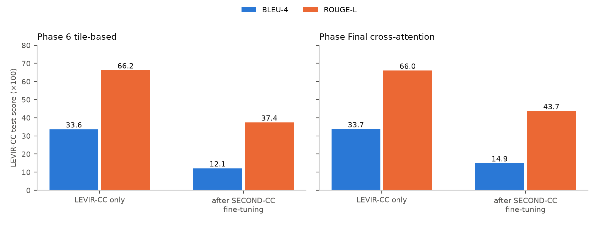
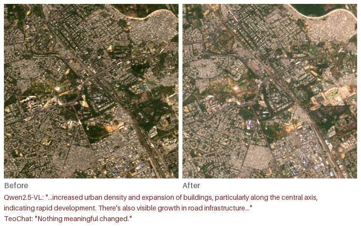

# Remote Sensing Image Change Caption Generation — Phase 1

*Adapting LEVIR-CC-trained change captioning models toward Indian imagery*

**[Author names]** · **[Affiliation]** · October 2026

---

## Preface

This report covers the first phase of our work on remote sensing image change captioning (RSICC). We built a modular captioning pipeline on the LEVIR-CC benchmark and developed it through a series of architectures, with the aim of adapting it to Indian imagery. The adaptation did not succeed, which led to the construction of a dedicated Indian Sentinel-2 dataset; that work is described in a companion report.

## Abstract

We developed a modular RSICC pipeline on LEVIR-CC and improved it in stages: a CNN baseline, a frozen RemoteCLIP encoder with difference fusion, a hierarchical tile-based model, and a RemoteCLIP cross-attention model with contrastive caption alignment. On the LEVIR-CC test set, BLEU-4 rose from 30.3 to 33.7 and ROUGE-L from 62.1 to 66.0, with the gains flattening after the first architectural change. Extending the models to a second dataset (SECOND-CC) by sequential fine-tuning caused severe forgetting: LEVIR-CC BLEU-4 fell to 12–15. Later designs that coupled a RemoteCLIP encoder to a large language-model decoder (Qwen2-VL family) were implemented, but training diverged and no evaluation was completed. Finally, a pilot Indian Sentinel-2 dataset was collected and off-the-shelf vision-language captioners were tried on it; their captions were unusable, ranging from empty or garbled output to a blanket "nothing changed". **We conclude that models trained on LEVIR-CC do not provide a viable route to change captioning of Indian imagery, and that a purpose-built, reliably labelled Indian dataset is required.**

---

## 1. Introduction

LEVIR-CC is the standard RSICC benchmark: about 10,000 bi-temporal image pairs (256×256 px, 0.5 m resolution) of urban and suburban areas in Texas, USA, each with five reference captions. It is dominated by building and road construction and contains no Indian landscapes, monsoon-driven seasonal change, or the medium-resolution imagery freely available across India.

Our goal in Phase 1 was to build a captioning model on LEVIR-CC, improve it, and then adapt it to Indian imagery. The phase had three parts:

1. **Model development on LEVIR-CC** (Section 3): four architectures in a shared, comparable pipeline.
2. **Cross-dataset extension** (Section 4): sequential fine-tuning on SECOND-CC, and language-model decoders aimed at domain adaptation.
3. **Moving to Indian imagery** (Section 5): a pilot Sentinel-2 dataset and off-the-shelf captioners.

## 2. Shared pipeline

All models were trained and evaluated in one modular codebase, so results are directly comparable:

- **Data:** the official LEVIR-CC train/validation/test splits; images resized to 256×256 (224×224 for RemoteCLIP models) with the matching normalisation.
- **Vocabulary:** one shared vocabulary built from the training captions (minimum word frequency 2).
- **Training:** caption cross-entropy loss, batch size 16, gradient clipping, Adam with learning rate 1×10⁻⁴ and a cosine schedule, rolling "current" and "best" checkpoints.
- **Model interface:** every model implements `forward(images, caption_tokens) → logits`, so only the model definition changes between experiments.
- **Evaluation:** BLEU-1–4, METEOR, ROUGE-L and sentence-embedding similarity on all 1,929 test pairs.

## 3. Model development on LEVIR-CC

| Phase | Architecture | Trainable parameters |
|---|---|---|
| 1 | Two-stream CNN encoder with difference fusion + 2-layer Transformer decoder (baseline) | — |
| 2 | Frozen RemoteCLIP ViT-B/32 encoder, absolute-difference fusion, same decoder | 3.4 M of 154.7 M |
| 6 | Hierarchical tile-based model: tiles encoded by a shared RemoteCLIP backbone, bidirectional tile differences, tile-fusion Transformer | 13.8 M of 165.1 M |
| Final | RemoteCLIP with cross-attention fusion between dates + contrastive caption–image alignment | 9.1 M of 160.4 M |

**Results (LEVIR-CC test set, 1,929 pairs):**

| Phase | Test loss | BLEU-1 | BLEU-4 | METEOR | ROUGE-L | Sentence similarity |
|---|---|---|---|---|---|---|
| 1 Baseline | 0.969 | 47.2 | 30.3 | 59.7 | 62.1 | 64.8 |
| 2 RemoteCLIP difference | 0.935 | 51.7 | 32.8 | 63.0 | 65.5 | 70.6 |
| 6 Tile-based | 0.923 | 52.1 | 33.6 | 63.6 | 66.2 | 71.5 |
| Final Cross-attention | 0.898 | 53.1 | 33.7 | 63.9 | 66.0 | 71.2 |

*Figure 1. LEVIR-CC test scores for each architecture.*

**Findings:**

- Replacing the CNN encoder with a remote-sensing-pretrained encoder (RemoteCLIP) gave the largest single improvement.
- Further architectural complexity (tiles, cross-attention, contrastive alignment) added little: BLEU-4 moved from 32.8 to 33.7 and ROUGE-L stayed around 66.
- Qualitatively, the models handle the dominant LEVIR-CC patterns well, in particular "there is no difference" for unchanged pairs and "a house / road appears" for construction. They produce generic or templated descriptions for more varied changes.

## 4. Cross-dataset extension

### 4.1 Sequential fine-tuning on SECOND-CC

To move beyond LEVIR-CC, the Phase 6 and Final models were fine-tuned on SECOND-CC, a second change-captioning dataset with more varied land-cover changes, and then evaluated on both test sets.

| Model | LEVIR-CC BLEU-4 before → after | LEVIR-CC ROUGE-L before → after | SECOND-CC BLEU-4 | SECOND-CC ROUGE-L |
|---|---|---|---|---|
| Phase 6 Tile-based | 33.6 → 12.1 | 66.2 → 37.4 | 12.3 | 41.6 |
| Final Cross-attention | 33.7 → 14.9 | 66.0 → 43.7 | 13.0 | 43.3 |

*Figure 2. LEVIR-CC test scores before and after sequential fine-tuning on SECOND-CC.*

Fine-tuning on the second dataset caused **catastrophic forgetting**: LEVIR-CC test loss rose from about 0.9 to 3.5–4.1 and BLEU-4 fell by more than half. Performance on SECOND-CC itself also remained low. A model adapted in this way loses what it learned on the source dataset without becoming good on the target.

### 4.2 Language-model decoders (Phases 7–8)

The next designs replaced the small Transformer decoder with a pretrained language model, aiming at richer captions and domain adaptation:

- **Phase 7 (CodeAug):** RemoteCLIP ViT-L/14 with LoRA adapters, a Q-Former compressing the visual tokens, and a 4-bit-quantised Qwen2-VL-2B text decoder, plus vegetation-index masking intended to suppress seasonal false changes.
- **Phase 8:** a lighter hybrid with a Qwen2-0.5B decoder and a learned bridge between visual and text features, trained in stages.

Both designs were implemented. Training ran into numerical instability: the stage-2 loss diverged to NaN. The cause was traced to unbounded bridge outputs overflowing the half-precision language model, and a fix was applied, but no complete training and evaluation run was achieved, so **no results are reported for these designs.** They were also constrained by the available GPUs (11 GB Pascal/Turing cards without bfloat16 support), which forced aggressive quantisation, very small batches and strictly sequential jobs.

## 5. Moving to Indian imagery

### 5.1 Pilot Indian Sentinel-2 dataset

A pilot dataset was collected from Sentinel-2 imagery over hand-picked Indian areas of interest in five categories (urban, deforestation, agriculture, coastal, infrastructure). Each area was tiled into 512×512 patches, and before/after pairs several years apart were kept only if their change magnitude exceeded a threshold. Of 2,126 tiles checked, **1,072 pairs** were kept (Figure 3).

*Figure 3. A sample pair from the pilot Indian Sentinel-2 collection.*

### 5.2 Off-the-shelf captioners on Indian pairs

Because no Indian captions existed to fine-tune on, two pretrained captioners were run directly on a 30-pair sample:

- **TeoChat**, a temporal remote-sensing vision-language model, answered "Nothing meaningful changed" for 27 of 30 pairs, including pairs with visible change. One answer described damage from a hurricane that did not occur.
- **Qwen2.5-VL** produced empty or garbled output (non-English text or repeated tokens) for many pairs in its first run. Retries and 8-bit loading reduced but did not remove these failures. When it did answer, it tended to describe confident, generic "urban development" on scenes that were largely unchanged.

*Figure 4. One Indian pair and the two captioners' answers. One describes broad urban growth, the other reports no change; neither describes the specific change visible on the right side of the scene.*

Neither model gave captions usable as training labels or as a deployed system.

## 6. Limitations

1. **Evaluation protocol.** Captions were scored against a single reference caption per image, while the LEVIR-CC literature scores against all five. Our scores are therefore comparable across our own models but not directly with published results. The pipeline's CIDEr implementation is a simplified approximation and is not reported.
2. **Domain gap.** LEVIR-CC covers sub-metre imagery of one US region. Its scenes, change types and resolution differ fundamentally from Indian Sentinel-2 imagery, so gains on LEVIR-CC do not indicate performance on the target domain.
3. **Forgetting under sequential fine-tuning.** Only plain sequential fine-tuning was tried. Methods that limit forgetting (joint training, replay, or adapters) were not evaluated.
4. **Incomplete language-model designs.** The Phase 7–8 designs never completed a training and evaluation run, so their potential remains unmeasured.
5. **Compute.** The institute cluster offered a single older GPU at a time, without bfloat16 support. This limited model size, batch size and the number of experiments, and was a major bottleneck across the phase.
6. **Small Indian sample.** The off-the-shelf captioners were tried on only 30 Indian pairs, without reference captions, so that check is qualitative.

## 7. Conclusion

Phase 1 established a modular, reproducible RSICC pipeline and showed that a remote-sensing-pretrained encoder is the most useful single improvement on LEVIR-CC, while further architectural complexity brought diminishing returns. Moving beyond LEVIR-CC failed at every step:

- sequential fine-tuning to a second dataset erased most of what the model had learned
- language-model decoders could not be trained to completion on the available hardware
- off-the-shelf captioners produced unusable captions for Indian imagery

Together these results show that a model trained on LEVIR-CC is not a viable path to change captioning of Indian imagery. The missing ingredient is data: Indian bi-temporal imagery with reliable change labels. That conclusion motivated the dataset construction described in the companion report.
